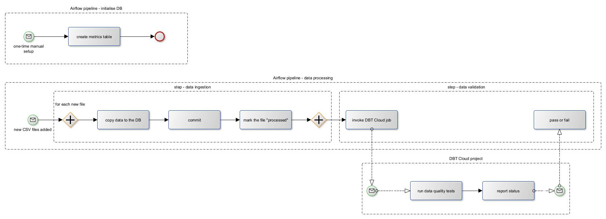
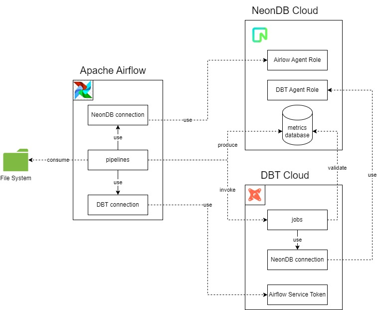

# Overview
In this practical module, you're going to get hands-on experience with Apache Airflow. The goal is to build a simple data pipeline which incrementally ingests data from a CSV file storage, stores it in a data warehouse ([NeonDB](https://neon.tech/) in this case), and runs some quality checks on it using a [DBT Cloud](https://www.getdbt.com/product/dbt-cloud) job:

For all this to work, you'll have to create the following logical structure:

# Pitfall - please, pay attention
While the overall solution is relatively simple and may be completed in a couple of days, be aware that you will have **2 weeks to complete everything since your DBT Cloud registration**.

Why?
- for this practical task, we need to use DBT Cloud REST API to trigger data quality jobs on behalf of Apache Airflow
- the REST API feature (as of the time of this writing) is available in **paid DBT Cloud subscription** or **2-week free trial**
- so, you have to complete the Airflow-DBT integration in 2 weeks after creating your DBT account or pay a fee

Please, notice that **everything prior the DBT job and Airflow-DBT integration may be complete without deadlines**.