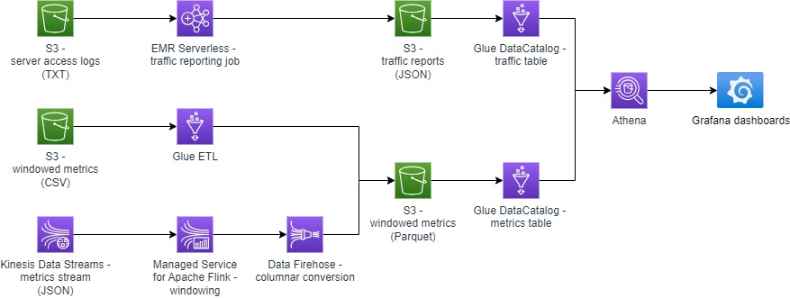

# Topics to cover
- AWS Glue
  - AWS Glue ETL jobs for lightweight data transformations
  - AWS Glue Data Catalog for describing data schema
  - Data partitioning
- AWS Athena
  - integration with AWS Glue
  - SQL queries
- Grafana
  - data visualisation basics
  - connecting to AWS Athena
- AWS streaming
  - streaming data with AWS Kinesis
  - aggregating data with AWS Managed Service for Apache Flink
  - converting data with AWS Firehose
- AWS EMR
  - writing serverless Spark analytical jobs

# Who is Data Engineer in AWS
According to the [AWS certification guidelines](https://d1.awsstatic.com/training-and-certification/docs-data-engineer-associate/AWS-Certified-Data-Engineer-Associate_Exam-Guide.pdf), a data engineer should be able handle
- serverless and container resource in the cloud
  - data ingestion and transformation
  - choices of appropriate ingestion services
  - streaming
  - batching
  - stateful and stateless data transactions
  - ETL pipelines
  - pipeline orchestration
  - event-driven architectures
- data store management
  - storage choice based on load and usage patterns
  - storage formats (Parquet, TXT, etc.)
  - data migration
  - data cataloging and classification
  - data lifecycle management including tiering, retention, and availability
  - data schema design and evolution
- data operations and support
  - automate data processing
  - data analysis and visualization
  - audit and lineage
  - data quality
- data security and governance
  - VPC security
  - authentication and authorization
  - data encryption and masking
- for all the above
  - monitoring and alerting
  - performance optimization
  - cost optimization
  - IaC and CI/CD

In this training though, we will focus only on
- data ingestion
  - with the CSV, JSON, and Parquet formats
  - from streaming sources
  - from batched sources
- data processing using ETL and realtime streaming
- basic analytics and visualization

# Prerequisites
- Some learning self-study materials are hosted on the **AWS Skills Builder** platform. To access it, please, create an **AWS Partner Network** account as described in [this guide](https://kb.epam.com/pages/viewpage.action?pageId=918404939).

# Solution overview

Key elements
* the overall goal is to build a system for monitoring a set of microservices
  * one “legacy” set of services work somewhere outside the cloud and delivers pre-aggregated stats in batches - _windowed metrics (CSV)_
  * another “modern” set of services reside in the cloud and report in real time - _metrics stream_
  * also, there are server access logs collected in batches - _server access logs (TXT)_
* a lightweight ETL job is required to convert the CSV metrics into Parquet
* a streaming pipeline is required to aggregate, convert, and deliver the realtime metrics to the same Parquet bucket
* a Spark job is required to build daily intra-service traffic reports based on the server access logs
* the traffic reports and aggregated Parquet metrics should be queryable through an SQL interface and visualised using interactive dashboards

# Data model

The details on what data model will be used in the practical task may be found in [this document](DATA_MODEL.md).

# How to get test data

In order to test each component of the implemented solution, you may use the test data generator described in [this document](TEST_DATA.md).
