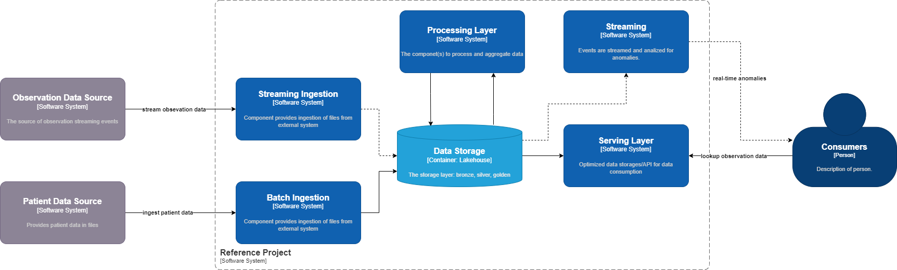
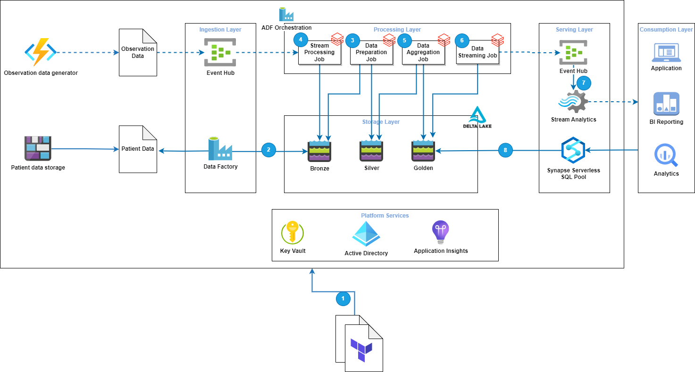

= Data Engineering in Azure
Dzmitry Marudau <dzmitry_marudau@epam.com>
1.0, October 21, 2024: Initial version from README.md
:toc:
:toclevels: 4
:icons: font
:url-quickref: https://docs.asciidoctor.org/asciidoc/latest/syntax-quick-reference/

== Who is *Data Engineer* in Azure

Below you can find the Data Engineer definition according to the https://learn.microsoft.com/en-us/credentials/certifications/azure-data-engineer/[Azure Data Engineer]

An Azure data engineer should have subject matter expertise in integrating, transforming, and consolidating data from various structured, unstructured, and streaming data systems into a suitable schema for building analytics solutions.

As an Azure data engineer, you help stakeholders understand the data through exploration, and build and maintain secure and compliant data processing pipelines by using different tools and techniques. You use various Azure data services and frameworks to store and produce cleansed and enhanced datasets for analysis. This data store can be designed with different architecture patterns based on business requirements, including:

* Modern data warehouse (MDW)
* Big data
* Lakehouse architecture

As an Azure data engineer, you also help to ensure that the operationalization of data pipelines and data stores are high-performing, efficient, organized, and reliable, given a set of business requirements and constraints. You help to identify and troubleshoot operational and data quality issues. You also design, implement, monitor, and optimize data platforms to meet the data pipelines.

You need to understand parallel processing and data architecture patterns. You should be proficient in using the following to create data processing solutions:

* Azure Data Factory
* Azure Synapse Analytics
* Azure Stream Analytics
* Azure Event Hubs
* Azure Data Lake Storage
* Azure Databricks

IMPORTANT: The current training doesn't cover all the skill set above and doesn't imply covering of all these topics.
In this training though, we will focus only on: +
— data ingestion +
— data processing using ETL and realtime streaming +
— basic analytics and visualization

== Azure Big Data Reference Project

=== Description
The project serves as a reference architecture for a lakehouse big data platform and aims to provide practical experience for those who are keen on data engineering and especially those based on Azure managed services.

=== Use Case

The case is taken from a real project, relates to healthcare industry and represents nessesaty to ingest patient data into platform along with their health observations (blood pressure, blood glucose, etc.). The Platform should be capable of storing, aggregating and providing holistic view on patient health conditions. Apart from that, it should react fast on any anomalies detected in patient's observations.

.Context View

The following case assumes that data is ingested in following paths:

- Initial patient data is to be sent via JSON files from external sources file storage.
- Stream of observation metrics that comes from external providers, presumable wearable devices.

=== Requirements

==== Patient Data Ingestion

- Initial data files represents patient information in standard  form of electronic health records. The format is called https://www.hl7.org/fhir/[FHIR].
- Data files are in *json* format and represents a set of electronic records. Example of such file is https://build.fhir.org/patient-example.json.html[FHIRE Patient].
- Sample files to be used for the tasks are already added to https://github.com/stanislav-zhurich/azure-big-data-reference-architecture/tree/main/samples[samples directory]
- Files are to be received via **Batch Ingestion Layer**, validated, processed and aggregated within **Data Storage Layer**. Clean and valuable information is exposed to customer from within **Serving Layer**.

==== Observation Data Ingestion

- Observation data is central element in healthcare, used to support diagnosis, monitor progress and capture results of tests. Observation resources include laboratory data, clinical findings and assessments, quality tests and etc. For the sake of simplicity we will focus only on blood pressure vital sign that's represents by following schema https://www.hl7.org/fhir/observation-example-bloodpressure.html[FHIR Blood Pressure].
- Observations are streamed into platform and consumed by **Streaming Ingestion Layer**.
- After that observation data is processed, optimized, aggregated and stored within **Data Storage Layer**.
- Observation data should be exposed via Serving Layer for reporting and lookup operations.
- Observation data should be streamed and constantly monitored to understand if there are any anomalies in measurements.

=== Architecture
As for architecture foundation we rely on https://dbricks.co/38dVKYc[Lakehouse architecture] concept that addresses many of the challenges applicable for traditional data architectures. With this approach there is no longer a strong separation between data lake and data warehouse, instead the outputs from the lake are served using the https://docs.databricks.com/delta/index.html[Delta Lake format]. +
When it comes to technical implementation the solution might leverage either https://learn.microsoft.com/en-us/azure/synapse-analytics/overview-what-is[Microsoft Azure Synapse Analytics] (that is a powerfull platform that brings together support of multiple data related services available in Azure) or combination of https://learn.microsoft.com/en-us/azure/data-factory/introduction[Azure Data Factory] and https://learn.microsoft.com/en-us/azure/databricks/getting-started/[Azure Databricks]. The last combination has been chosen over Synapse due to:

- Synapse Spark Pool currently doesn't support Spark Structured Streams on Deltalake that is required in our streaming scenario.
- Fewer charges due to more flexibility in compute resources.
Down below you can find high level component architecture that depicts the main part of the platform along with mapping to the tasks to be accomplished.

.Component View

=== Tasks
1. The very https://git.epam.com/epm-cdp/global-java-foundation-program/java-courses/-/tree/main/data-training-for-devs/courses/Data_Training_for_Java_developers/azure/tasks/task-1%20(setup%20environment)[first task] is to prepare environment to build the solution on top. Provided terraform scrips along with materials will deploy the core part of the platform.
2. https://git.epam.com/epm-cdp/global-java-foundation-program/java-courses/-/tree/main/data-training-for-devs/courses/Data_Training_for_Java_developers/azure/tasks/task-2%20(batching%20-%20copy%20from%20source%20to%20bronze)[The second task] implies creation of Azure Data Factory activity to copy data from external Blob Storage to platform Bronze storage layer (landing zone).
3. After data is being stored in our landing zone it must be refined and transformed to delta table. That is the scope of https://git.epam.com/epm-cdp/global-java-foundation-program/java-courses/-/tree/main/data-training-for-devs/courses/Data_Training_for_Java_developers/azure/tasks/task-3%20(batching%20-%20copy%20from%20bronze%20to%20silver)[the third task].
4.  https://git.epam.com/epm-cdp/global-java-foundation-program/java-courses/-/tree/main/data-training-for-devs/courses/Data_Training_for_Java_developers/azure/tasks/task-4%20(streaming%20-%20read%20streaming%20data%20from%20source)[The fourth task] relates to ingestion of streaming observation event to the platform. Events are to be generated by provisioned Azure Function and sent to Event Hub. The goal is to store observation in delta table.
5. https://git.epam.com/epm-cdp/global-java-foundation-program/java-courses/-/tree/main/data-training-for-devs/courses/Data_Training_for_Java_developers/azure/tasks/task-5%20(batching%20-%20copy%20from%20silver%20to%20gold)[The fifth task] requires you to prepare data to be read by business consumer from Gold layer.
6. In the following https://git.epam.com/epm-cdp/global-java-foundation-program/java-courses/-/tree/main/data-training-for-devs/courses/Data_Training_for_Java_developers/azure/tasks/task-6%20(streaming%20-%20write%20to%20event%20hub)[sixth task] you'll be asked to implement streaming observation data from from delta table to outbound Event Hub.
7. The goal of https://git.epam.com/epm-cdp/global-java-foundation-program/java-courses/-/tree/main/data-training-for-devs/courses/Data_Training_for_Java_developers/azure/tasks/task-7%20(consumption%20-%20read%20observation%20data)[the seventh task] is to implement solution to be able to analyze patient's observation data on runtime.
8. And finally, within https://git.epam.com/epm-cdp/global-java-foundation-program/java-courses/-/tree/main/data-training-for-devs/courses/Data_Training_for_Java_developers/azure/tasks/task-8%20(consumtion%20-%20read%20patient%20data)[the eighth task] you need to integrate Synapse Serverless SQL Pool with delta tables from Gold layer.
9. Don't forget
to clean everything upon completion of a task in the scope of https://git.epam.com/epm-cdp/global-java-foundation-program/java-courses/-/tree/main/data-training-for-devs/courses/Data_Training_for_Java_developers/azure/tasks/task-9%20(clean-up)[the ninth task].

=== Cost Consideration
==== Assumptions
- It is recommended to use https://azure.microsoft.com/en-us/free[Azure Free Trial account] that has $200 credit.
- The Average time spent on home task completion is around **20 hours**.
- The region of running environment is `West Europe`. All required services are available there.

==== Cost Calculation

[cols=4*,options=header]
|===
|Service| Free tier |Pricing Options |Cost
|Blob Storage|5 GB locally redundant storage (LRS) hot block with 20,000 read and 10,000 write operations||$0.01|
|Data Factory|5 low-frequency activities|$0.001/per run, $0.25/diu per hour|~$2-$3
|Key Vault|10,000 transactions RSA 2048-bit keys or secret operations, Standard tier|$0.03 per 10k operations|$0.01|
|Event Hub||$0.015/hour per Throughput Unit (MB/s ingress and 2 MB/s egress)|$1|
|Stream Analytics||$0.110 per hour/unit| ~$2|
|Databricks|15 day of trial period| All-Purpose Compute Cluster, F4_Standard  Instance (4 vCPU, 8 GiB)| ~$9

|===

NOTE: Overall costs are expected to be around **$15**. They can be cut applying Free Trail subscription.

== Next Steps

If you are willing to acquire more knowledge in Azure Data Engineering you might consider passing https://learn.microsoft.com/en-us/credentials/certifications/azure-data-engineer/[Azure Data Engineer Associate Program] along with taking corresponding https://learn.microsoft.com/en-us/credentials/certifications/exams/dp-203/[certification].

== Materials

=== Reference Architecture

- https://learn.microsoft.com/en-us/azure/architecture/example-scenario/dataplate2e/data-platform-end-to-end?tabs=portal[Azure Synapse Analytics. End-to-And]
- https://learn.microsoft.com/en-us/azure/architecture/reference-architectures/data/stream-processing-databricks[Stream Processing with Databricks]
- https://learn.microsoft.com/en-us/azure/architecture/reference-architectures/data/stream-processing-stream-analytics[Stream Processing with Azure Stream Analytics]
- https://videoportal.epam.com/video/kaEOA2Je[Building ETL and Data Pipeline]

=== Azure Data Fundamental
- https://learn.microsoft.com/en-us/azure/architecture/data-guide/[Azure Data Architecture Guide]
- https://learn.microsoft.com/en-us/training/paths/azure-data-fundamentals-explore-core-data-concepts/[Microsoft Azure Data Fundamentals: Explore data analytics in Azure]
- https://learn.microsoft.com/en-us/training/paths/azure-data-fundamentals-explore-relational-data/[Microsoft Azure Data Fundamentals: Explore relational data in Azure]
- https://learn.microsoft.com/en-us/training/paths/azure-data-fundamentals-explore-non-relational-data/[Microsoft Azure Data Fundamentals: Explore non-relational data in Azure]

=== Azure Data Factory
- https://learn.microsoft.com/en-us/azure/data-factory/introduction[Azure Data Factory]
- https://learn.epam.com/detailsPage?id=40e290c3-6739-4945-b92e-258025451fe5[Data Integration with Azure Data Factory]
- https://www.youtube.com/watch?v=DLmlFlQGQWo[Azure Data Factory: Beginner to Pro [Live Event]]
- https://www.linkedin.com/learning/azure-data-factory-17547557/pipelining-data-with-azure-data-factory?u=2113185[Pipelining Data With Azure Data Factory]
- https://www.youtube.com/watch?v=Ej-rpXs3yz0[Azure Data Factory [Full Course]]
- https://www.pluralsight.com/courses/building-first-data-pipeline-azure-data-factory[Building First Data Pipeline with Azure Data Factory]

=== Azure Data Explorer
- https://www.youtube.com/watch?v=ZyXppoFRiC8[Azure Data Explorer L300 workshop – Hands-on lab]
- https://www.youtube.com/playlist?list=PLwyttaal5U3qNSYVtJ5tS9Xqn2AzHFaCR[Azure Data Explorer]
- https://www.pluralsight.com/courses/microsoft-azure-data-explorer-advanced-query-capabilities[Azure Data Explorer Advanced Query Capabilities]

=== Azure Event Hub
- https://www.pluralsight.com/courses/microsoft-azure-building-streaming-data-pipelines[Building Streaming Data Pipelines]
- https://www.pluralsight.com/courses/handling-streaming-data-azure-event-hub[Handling Streaming Data Azure Event Hub]

=== Azure Databricks
- https://learn.microsoft.com/en-us/azure/databricks/[Azure Databricks]
- https://www.linkedin.com/learning/azure-spark-databricks-essential-training/optimize-data-pipelines?dApp=53239054&leis=LAA&u=2113185[Azure Databricks Essentials]

=== Azure Stream Analytics
- https://learn.microsoft.com/en-us/azure/stream-analytics/[Azure Stream Analytics]
- https://www.pluralsight.com/courses/azure-stream-analytics-understanding[Azure Strem Analytics Understanding]
- https://learn.microsoft.com/en-us/shows/cloud-and-enterprise-premium/deep-dive-azure-stream-analytics-query-language[Deep Dive into Azure Stream Analytics Query Language]
- https://www.youtube.com/watch?v=ApMjurulHBM[Real-Time Data Streaming with Azure Stream Analytics]

=== Azure Synapse
- https://learn.epam.com/detailsPage?id=3d6972ab-70fe-4143-adf5-d845ae1bc867[Microsoft Azure Synapse for Developers]
- https://www.youtube.com/watch?v=ZZBaXGCcJWQ[Head First Dive Into Azure Synapse Analytics Spark Pools]

=== Other Programs
- https://learn.epam.com/detailsPage?id=9ada9581-85ef-41a4-be42-340452be3e93[Azure Data Integration Mentoring Program]
