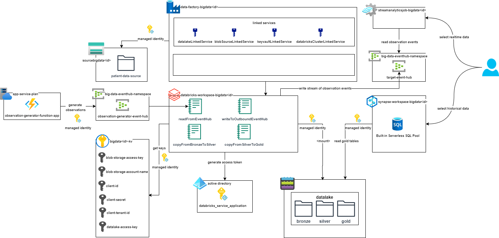

= Task 1 - Infrastructure Setup
Dzmitry Marudau <dzmitry_marudau@epam.com>
1.0, October 22, 2024: Initial version from README.md
:toc:
:toclevels: 4
:icons: font
:url-quickref: https://docs.asciidoctor.org/asciidoc/latest/syntax-quick-reference/

> > *Time to complete*: 1 hour

== Objective
The goal of this task is to prepare Azure infrastructure by completing the following lessons. You will be provided with Terraform scripts that will set up all required components. In scope of this project you will be doing coding tasks mostly on top of an already created component just to avoid tedious and error-prone configuration part.

== Prerequisites
. Azure personal account or https://azure.microsoft.com/en-us/pricing/purchase-options/azure-account?icid=azurefreeaccount[Try Azure for free] if available.
. https://www.terraform.io/[Terraform] is installed locally on your machine.
. Java (at least version 17) is installed locally on your machine.
+
NOTE: You can use https://sdkman.io/[SDKMAN] to have different versions of Java SDK, Gradle and Mave
. https://maven.apache.org/download.cgi[Maven] is installed locally on your machine.
+
IMPORTANT:  It's required to be connected to VPN if you are working from Belarus.

. https://learn.microsoft.com/en-us/cli/azure/install-azure-cli[Azure CLI] is installed locally on your machine.
+
IMPORTANT:  If you are in Belarusian location, you might experience issue accessing terraform; hence VPN is required.

You can validate all tools required via following command:
[source,bash]
----
java --version && mvn --version && terraform --version && az --version
----

== Steps
. Compile and Build Azure Function to be used locally in the application.
- Navigate to `/materials/function` folder.
- Execute `mvn install` command.
- Make sure that `/materials/function/target/` folder contains compiled and built `function-1.0-SNAPSHOT.jar` file.

. Install environment.
- Navigate to `/terraform/azure` folder
- Open `terraform.tvars` file and adjust it
- Open `eventhub.tf` file and adjust all eventhub names to make them unique, f.e. you can add your surname as a prefix.
- Open `function.tf` file and adjust function's name(see "azurerm_linux_function_app") to make it unique, f.e. you can add your surname as a prefix.

- Set subscription: `export ARM_SUBSCRIPTION_ID="{AZURE_SUBSCRIPTION_ID}"`
- Execute the command: `terraform init`.
- Run `terraform plan` to review resources to be installed in your Azure subscription.
- Execute the command: `terraform apply`. Print `yes` once requested.
- Installation might take some time, upon completion you will be provided with several endpoints, these are paths to studios you will be working from. They will look like:
+
[source,bash]
----
> databricks_studio_url = "https://adb-123456789.19.azuredatabricks.net"

> datafactory_studio_url = "https://adf.azure.com/en/home"

> synapse_studio_url = "https://web.azuresynapse.net?workspace=%2fsubscriptions%2f4d45zb6a-1310-f0g1-90c2-d82d4d3cbc5f%2fresourceGroups%2fbigdataaaec111lzix_rg%2fproviders%2fMicrosoft.Synapse%2fworkspaces%2fsynapse-workspace-bigdataaaec111lzix"
----

. After completion, you will have core components being installed within your subscription. The picture below depicts main services.

== Validation
include::../validation/task1-checklist.adoc[]