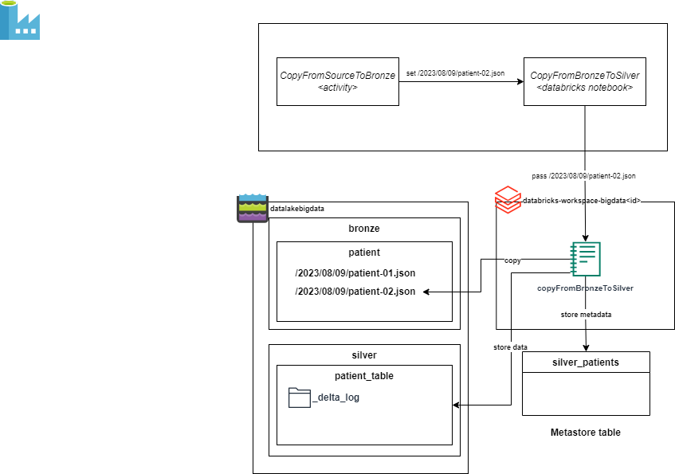

= Task 3 - Batching: copy from `Bronze` to `Silver` (refined) layer.
Dzmitry Marudau <dzmitry_marudau@epam.com>
1.0, November 6, 2024: Initial version from README.md
:toc:
:toclevels: 4
:icons: font
:url-quickref: https://docs.asciidoctor.org/asciidoc/latest/syntax-quick-reference/

> > *Time to complete*: 3 hours

== Objective
As soon as data is saved in bronze (landing) zone, the next step is to perform basic data clean up and transformation.
Data transformation will be done using `Databricks` notebook.
As part of `Data Factory` pipeline we will invoke `Databricks` notebook by passing
the file name being stored in bronze layer.
Notebook will be responsible for loading `json` data to dataframe, transforming it and storing in `delta` table.

== Steps
. Go to `Databricks` cluster and open `copyFromBronzeToSilver.py` notebook under `Workspace > Home > pipeline`.
+
[NOTE]
====
Databricks cluster endpoint might be found either in console after terraform scripts being installed or you might navigate via Azure Portal:
`your resource group > databricks-workspace-bigdata<id> > Overview > Launch Workspace`.
====

. Complete all steps defined in this notebook.

. Go to `Data Factory` Workspace (`data-factory-bigdata<id>`) and `Launch Studio`.

. Open `PatientDataIngestion` pipeline

. Create new `Databricks Notebook` Activity.
* Name: *CopyFromBronzeToSilver*
* Databricks linked service: *databricksClusterLinkedService*
* Notebook path: `/Users/<your_user>/pipeline/copyFromBronzeToSilver.py`
* Settings > Base parameters:
** *destination*: `@pipeline().parameters.destination`

. Connect `on Success` the existing `CopyFromSourceToBronze` activity with a newly added `CopyFromBronzeToSilver` activity by using Data Factory UI.

. Click on `Validate`, then `Publish all`

== Validation
include::../validation/task3-checklist.adoc[]

