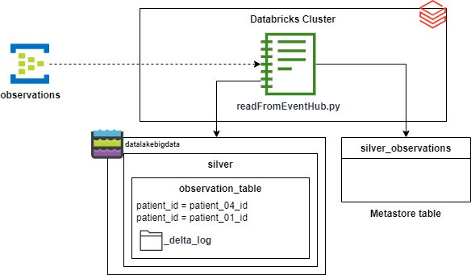

= Task 4 - Streaming: from Source to Silver
Dzmitry Marudau <dzmitry_marudau@epam.com>
1.0, November 10, 2024: Initial version from README.md
:toc:
:toclevels: 4
:icons: font
:url-quickref: https://docs.asciidoctor.org/asciidoc/latest/syntax-quick-reference/

> > *Time to complete*: 3 hours

== Objective
The goal of the task is to continuously stream data from Azure Even Hub, transform it and store into Silver (refined) layer.

== Steps
. Go to `Databricks` cluster and open `readFromEvenHub.py` notebook.

. Complete all steps defined in this notebook.

== Validation
include::../validation/task4-checklist.adoc[]

== Cleanup

[WARNING]
====
Remember to **stop the job manually**, as long as it's streaming one it will keep running without not being killed explicitly.
====

