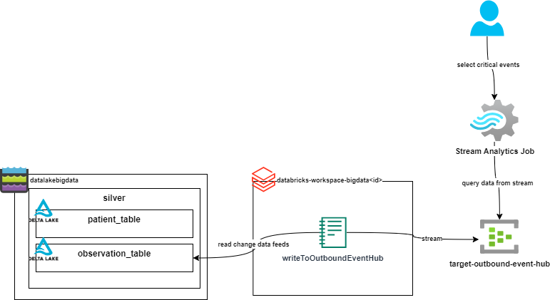

= Task 6 - Streaming. Write Observations to Event Hub.
Dzmitry Marudau <dzmitry_marudau@epam.com>
1.0, November 10, 2024: Initial version from README.md
:toc:
:toclevels: 4
:icons: font
:url-quickref: https://docs.asciidoctor.org/asciidoc/latest/syntax-quick-reference/

> > *Time to complete*: 3 hours

== Objective
To react fast on any abnormal patient's health metrics and conditions batching analytics is not enought. It's required to have access to such event in real time. To achieve that, we will be listening to `Delta` table change data feeds and publish these changes to outbound event hub.

The goal of the task is to stream patient observation events stored in Delta table to Event Hub. Stream Analytics Job is capable of reading this data using SQL syntax, filter it and send to consumer. For the sake of simplicity and costs, we will send result right to the Stream Analytics console.

== Steps
. Go to Databricks cluster and open `writeToOutboundEventHub.py` notebook.
. Execute all steps listed within notebook.
. Make sure that `readFromEventHub.py` notebook is running. This one is responsible for storing data in Delta table, change data feeds event from this table are to be consumed by new notebook.
. Run `writeToOutboundEventHub.py` notebook.

== Validation
include::../validation/task6-checklist.adoc[]

== Cleanup

. Make sure that both streaming jobs (`readFromEventHub.py` and `writeToOutboundEventHub.py`) are **stopped manually**, otherwise they will keep running indefinitely.

