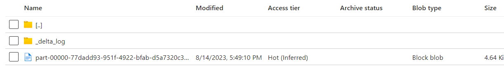

- [ ] Upload one of the patient sample files to  `sourcebigdata/patient-data-source/` folder.
+
[WARNING]
====
For the sake of simplicity,
the solution is not optimized for processing of multiple files being placed simultaneously to the source folder.
Although, it will work,
 most likely you'll come accross with *ConcurrentAppendException* within Notebook during merge operation.
The reason we are not partitioning the data in Bronze layer.
You can find more https://learn.microsoft.com/en-us/azure/databricks/optimizations/isolation-level[information]
how to resolve such kind of issues.
====
- [ ] Go to `Data Factory/Monitor/Pipeline Runs` and make sure that pipeline is completed successfully.
- [ ] Go to `datalakebigdata<id>/datalake/silver/patient_table` folder and make sure that the structure resembles the following one:
+

