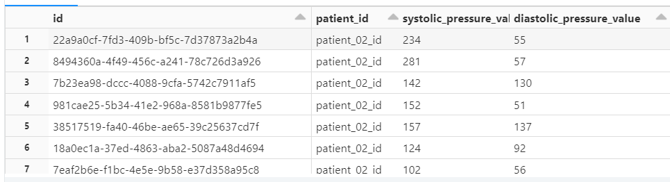

- [ ] Check if data is successfully streamed from EventHub and stored in data lake.
+

- [ ] From within databricks notebook execute the following command:
+
`select id, patient_id, systolic_pressure_value, diastolic_pressure_value from silver_observations`
+
Verify if a result resembles something like this:

+
