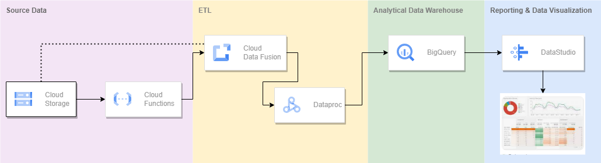

## **Summary**

Architecture description for Big Data project with GCP services.

It provides a detailed solution to do just that using Data storage,
Processing and Analytics with Google Cloud Platform.

In this project a Cloud Data Fusion Pipeline execution will be triggered
automatically with a Cloud Function every time a new data file is
uploaded to a Google Cloud Storage Bucket, this data pipeline will then
perform some transformations on the data and load the results into a
BigQuery table which feeds a report with a couple of visualizations
created in Data Studio.

## **Architecture**

### **GCP Services used for solution**

-   Google Cloud Storage

-   Google Cloud Functions

-   Google Cloud Data Fusion

-   Google BigQuery

-   Google Looker Studio (Data Studio)

### 

### **Description of the solution**

The idea is to create a very simple report in Data Studio that feeds
from a table previously created and loaded in BigQuery. The source data
resides in a single cumulative CSV file on premise that needs to be
somewhat transformed before being loaded into BigQuery, so a data
transformation pipeline in Data Fusion handles the transformations
required on the file and ingests the results in the BigQuery table, by
truncating the table first (although with the change of literally one
flag in the Data Fusion pipeline you may modify it to append data in the
BigQuery table rather than truncating the table every single run). The
source file is updated continuously and is uploaded to Google Cloud
Storage many times a day in an on-demand fashion, we don't know when a
new file may arrive but we know we need to refresh the report with any
new data that arrives as soon as it does, so we use a Cloud Function to
trigger the Data Fusion pipeline upon the event of a new CSV file being
uploaded to the Cloud Storage bucket. In this way, the whole process of
data ingestion, transformation, load and visualization is triggered by
simply uploading a new data file to a Google Cloud Storage bucket.

### **Main steps**

1.  Create the storage buckets we will use and prepare the source CSV
    file to be used to create the transformation pipeline.

2.  Create the Dataset and table in BigQuery that will store the data
    from the CSV file.

3.  Create the Data Fusion instance and assign proper roles to the
    Service Account it will use.

4.  Within the Data Fusion instance, create the Data Pipeline that will
    process the new CSV files and ingest them into the BigQuery table.

5.  Create the Cloud Function that will be triggered when a new file is
    uploaded to the defined Storage bucket, and will pass the newly
    added file to the Data Fusion pipeline for processing and ingestion
    to BigQuery.

6.  Create a simple report in Looker Studio with some visualizations of
    the data in BigQuery.

## **Steps** 

> ***Total Duration \[14h practice + 13h theory\] = 27h***

### **Environment preparation**

#### **Theory: Services overview** 

> ***Duration \[2h\]***

[[Products and Services \| Google
Cloud]](https://cloud.google.com/products)

#### **Practice: Prepare environment**

> ***Duration \[1h\]***

-   Install gsutil [[Install gsutil \| Cloud
    Storage]](https://cloud.google.com/storage/docs/gsutil_install)

-   How to use gsutil and useful commands is described here [[gsutil
    tool \| Cloud
    Storage]](https://cloud.google.com/storage/docs/gsutil)

