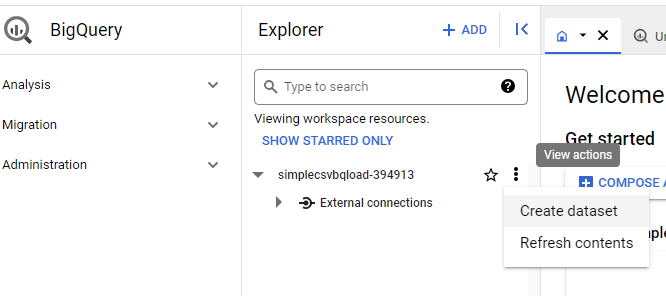
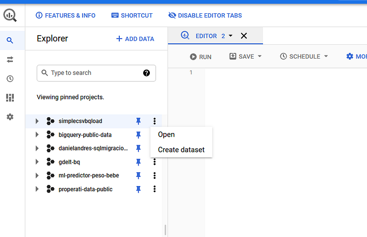
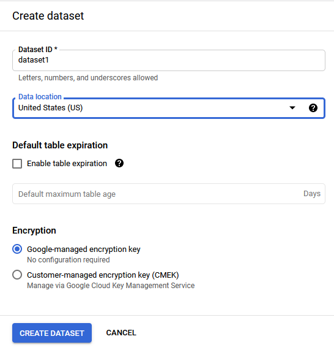
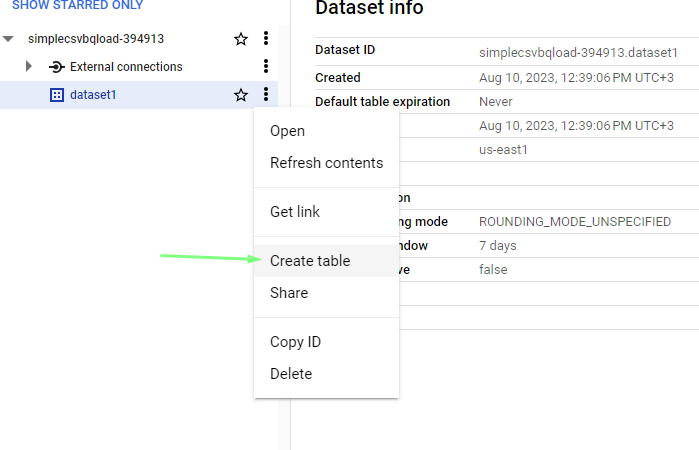
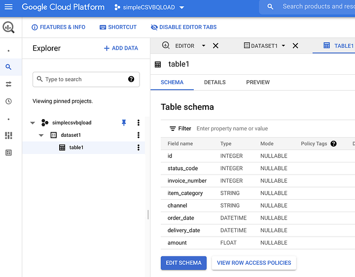

### **Task 2: Create the Dataset and table in BigQuery**

#### **Theory: BigQuery storage**

> ***Duration \[2h\]***

[[Overview of BigQuery storage \| Google
Cloud]](https://cloud.google.com/bigquery/docs/storage_overview)

#### **Practice: Create the Dataset and table in BigQuery**

> ***Duration \[2h\]***
>
> We will use the schema as the input for creating the table in BigQuery
> that will hold the data.
>
> Navigate to the BigQuery service and within you project, create a new
> dataset, for simplicity I named it dataset1 :
>
> 
>
> \
> 
>
> Then, within the newly created dataset, I just created a simple empty
> table and named it table1, with the same column names as the source
> CSV file and accommodating the corresponding data types. So it looks
> like this:
>
> \
> 

