### **Task 5: Create the Cloud Function**

#### **Theory: Cloud Function**

> ***Duration \[2h\]***
>
> [[Cloud
> Functions]](https://cloud.google.com/functions?hl=en)

#### **Practice: Create the Cloud Function**

> ***Duration \[3h\]***
>
> Now that the Data Fusion pipeline that will transform the data and
> load it into BigQuery is deployed and ready to be executed, we will
> set up the Cloud Function that will get Triggered whenever a new file
> is uploaded to the Data Source GCS bucket. The purpose of this
> Function is to pass the newly uploaded file to the Data Fusion
> pipeline and start its execution.
>
> For this, we will need to enable the Cloud Build API first, enable it
> if you haven't done so already:
>
> 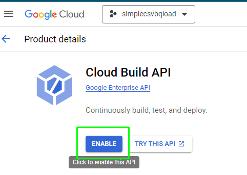
>
> Then, navigate to Cloud Functions:
>
> 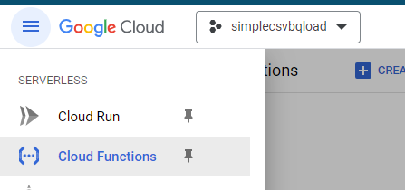
>
> Once you're in there, click on CREATE FUNCTION:
>
> Enable required API, if it is necessary:
>
> 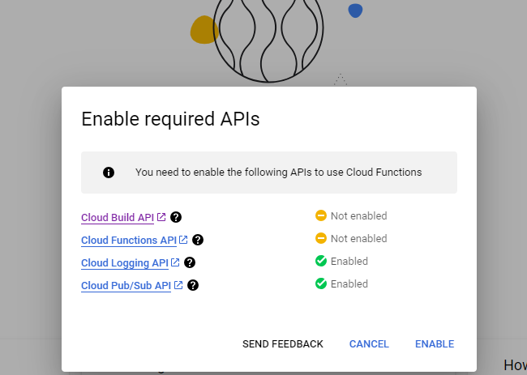
>
> Set the basic function configuration and Triggering behavior:
>
> 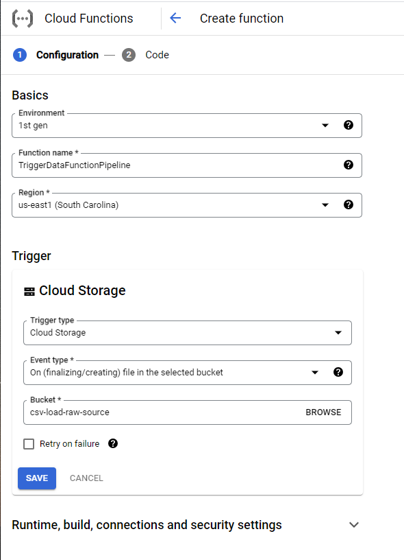
>
> Give the new Function a meaningful name, set the Trigger type to
> **Cloud Storage**, the Event Type to **Finalize/Create** and the
> Bucket to **\[YOUR_DATA_SOURCE_BUCKET\]** (csv-load-raw-source)**,**
> then hit the **SAVE** button.
>
> 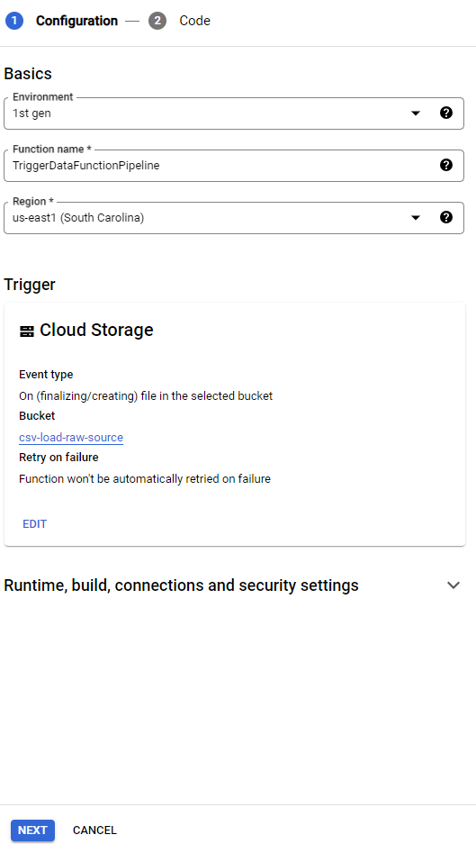
>
> Then click on the **NEXT** button below.
>
> 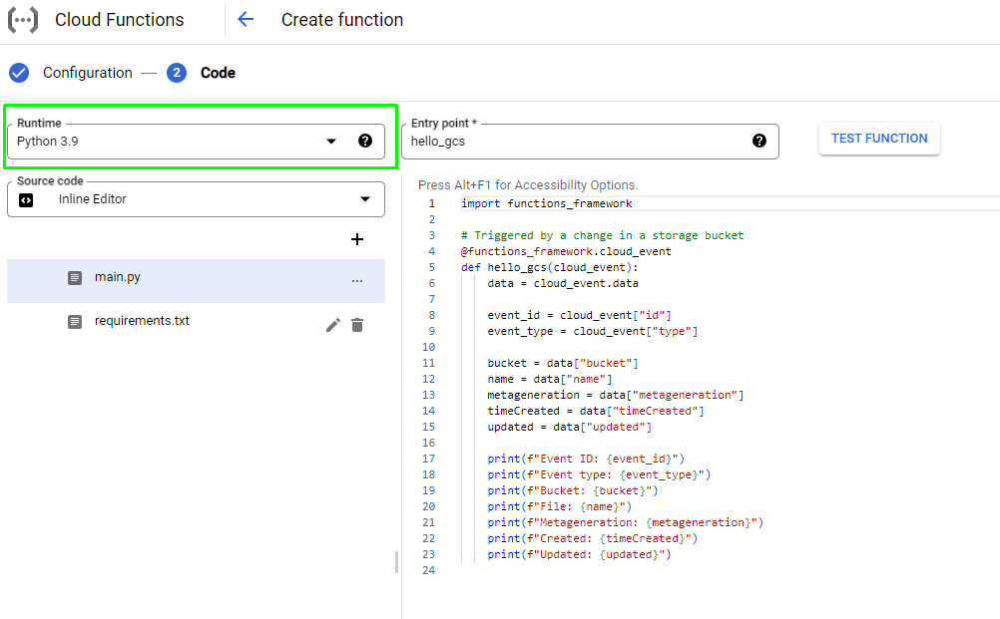
>
> In the Code section of the Cloud Function wizard, to the left you see
> a list of file templates that are automatically created for you and
> are required depending on the Runtime and language you will use to
> create your function. As we will create the function with the Python
> 3.9 runtime, 2 files are created: **main.py** and **requirements.txt**
>
> The requirements.txt file contains a list of the Python libraries and
> its versions that are referenced in the Python function itself and
> hence are required for the function to work. The main.py file contains
> the actual Python code that gets executed when the function is
> triggered.
>
> First we will edit the **requirements.txt** file, in there we will
> list down the Python libraries required for the Cloud Function, in the
> case, the only library that doesn't come bundled by default in the
> Runtime and that we will use in the **main.py** file is the requests
> library (which we will use in the script to send an HTTP POST request
> the Data Fusion REST API to start the data pipeline we created earlier
> with Data Fusion, and to retrieve an access token from the Metadata
> Server):
>
> Select **Python 3.9** in the **Runtime** dropdown, then click in the
> requirements.txt file below and add the following line to the
> requirements.txt file:
>
> **requests\>=2.25.1**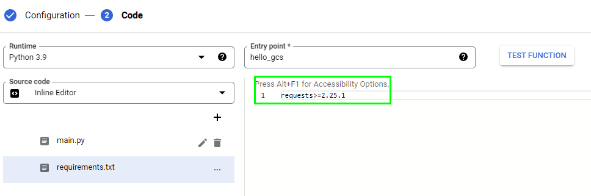
>
> Then we edit the main.py file and write the python script that will
> run whenever a new file is uploaded to the Storage Bucket we specified
> earlier:
>
> You can find main.py
> [[here]](https://github.com/stroyanov/gcp-bigdata-practice/blob/main/cloud_function/main.py)
>
> 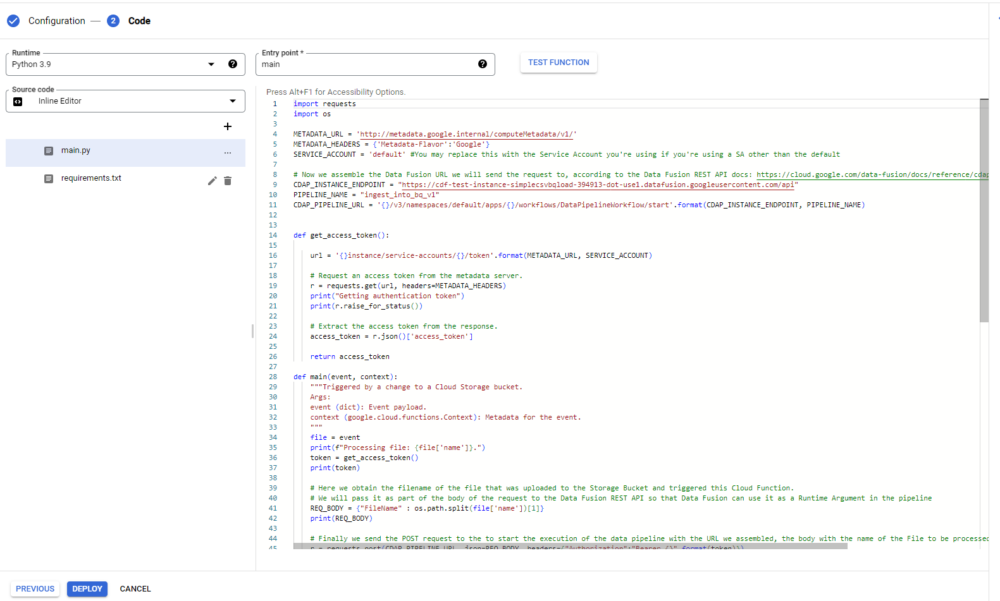

**Remember to replace the values in the YOUR_CDAP_INSTANCE_ENDPOINT and
YOUR_PIPELINE_NAME constants with your Data Fusion instance's endpoint.
You can find out your instance's endpoint by running the following
command in the cloud shell:**

gcloud beta data-fusion instances describe \--location=\${LOCATION}
\--format=\"value(apiEndpoint)\" \${INSTANCE_ID}

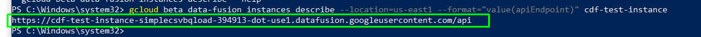

Paste it into code

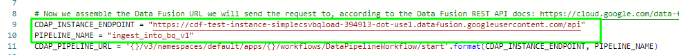

Finally, click on **DEPLOY**, the function should take a couple of
minutes to deploy. When it finishes you should see it listed under the
deployed Functions as a correctly deployed function like this:

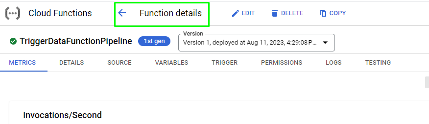

Then, click to **Function
details:**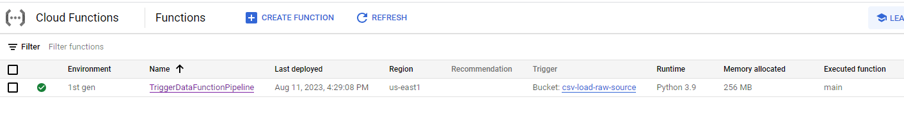

To test that everything is working as expected so far, we will simply
upload a CSV file to **gs://\[YOUR_DATA_SOURCE_BUCKET\]**
(gs://csv-load-raw-source) it doesn't matter how you name the file, as
long as the data and headers remain the same as the Sample file we
uploaded at the beginning.

gsutil cp SampleFile1.csv gs://csv-load-raw-source

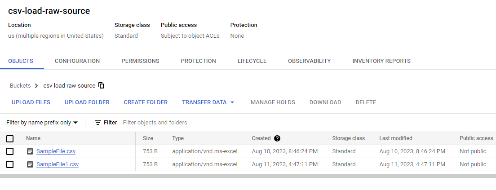

You can confirm the Cloud Function ran by checking the function logs in
you function:

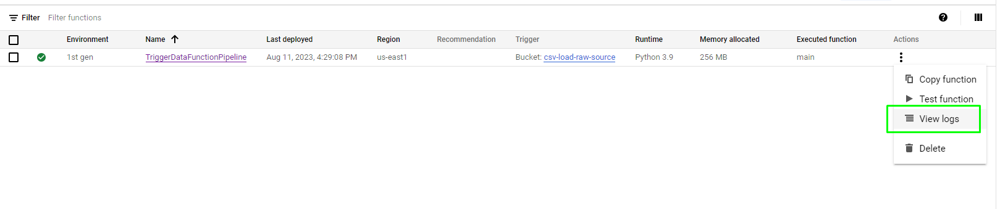

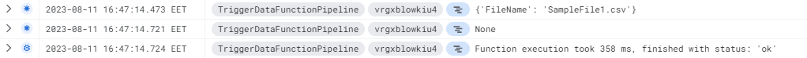

You can also confirm that the Data Fusion pipeline was started by the
function in the Data Fusion instance UI:

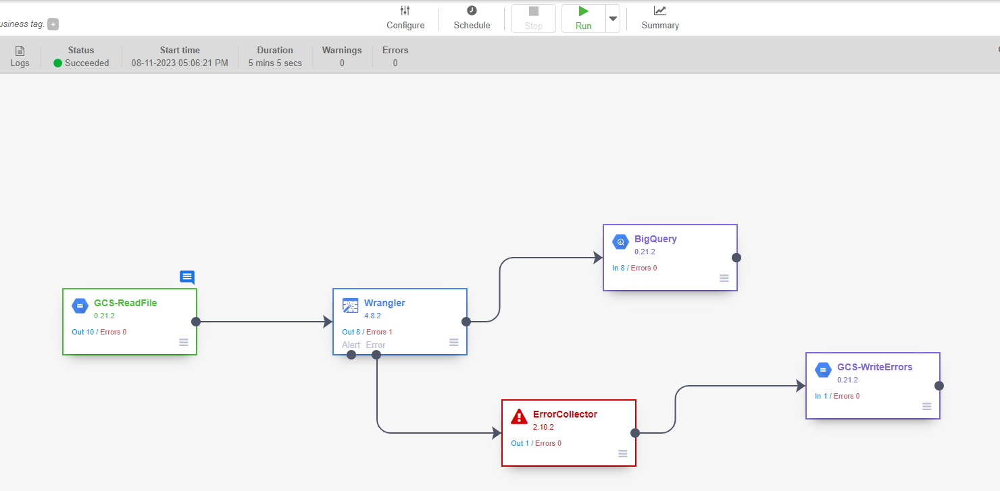

The Status will change from **Deployed**, to **Provisioning** and then
to **Running**.

In the Dataproc Clusters page, you will see that Data Fusion has spawned
an ephemeral cluster that will stay alive as long as the pipeline is
running, and when it finishes it will get destroyed:

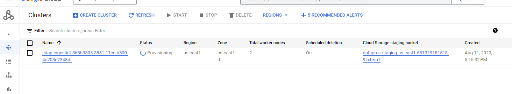

After around 5 to 6 minutes, the pipeline execution will finish and the
status will change to **Succeeded** and you will see in Data Fusion how
many records were passed from each step to the next one. By clicking in
**Runtime Args** at the top, you can also see the value that the Cloud
Function passed as FileName argument to the pipeline:

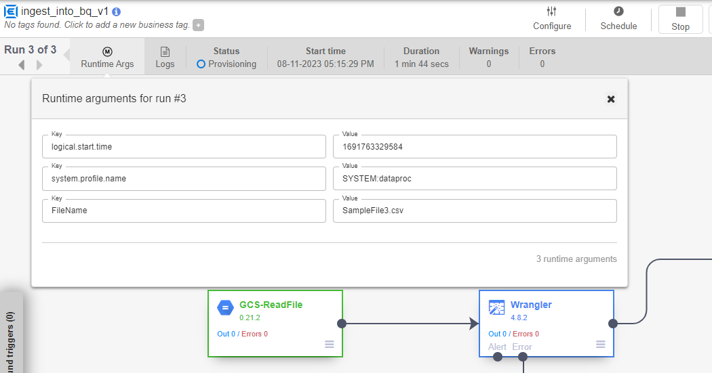

Finally in BigQuery you can check the records were loaded in the
BigQuery table:

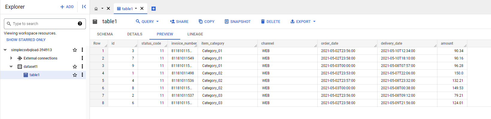

