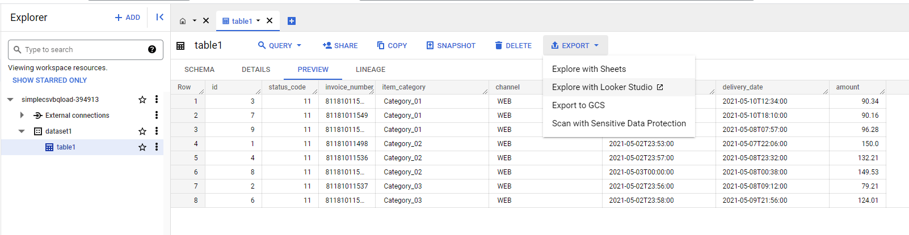
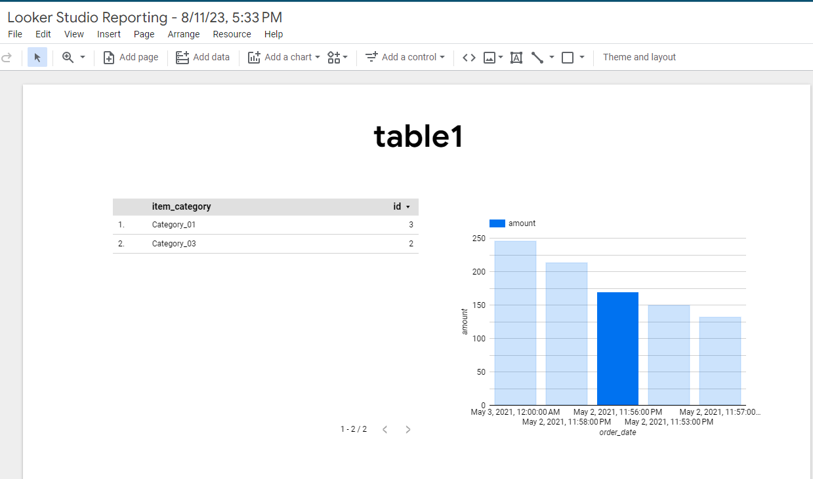
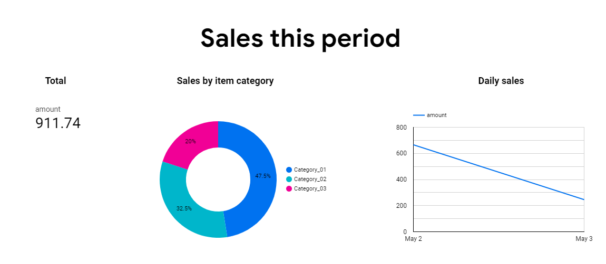
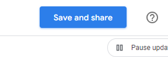
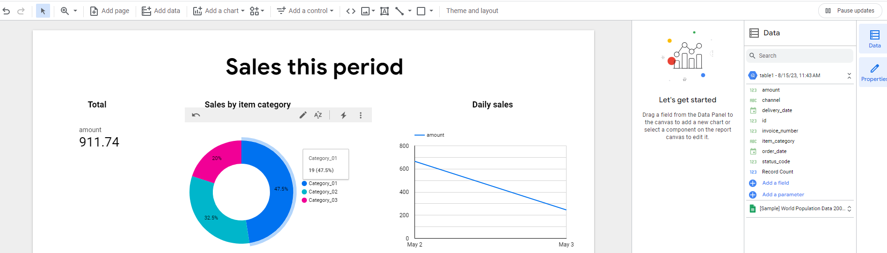
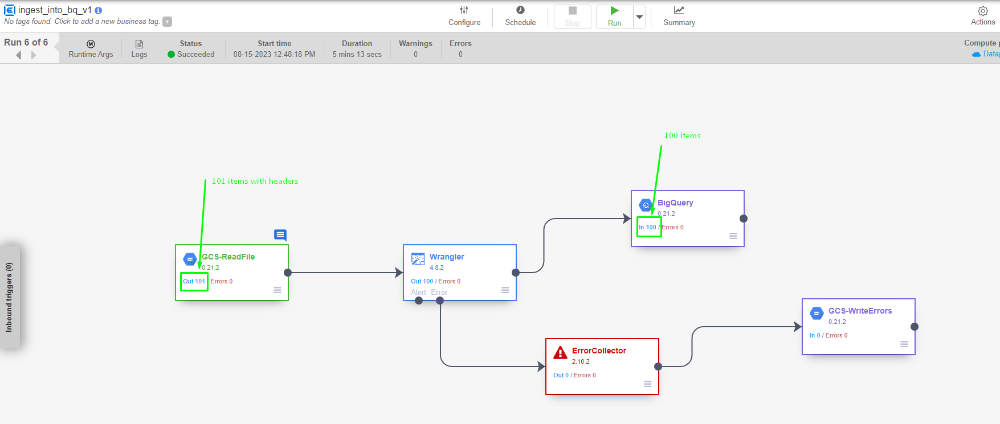
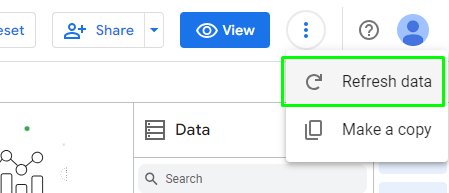
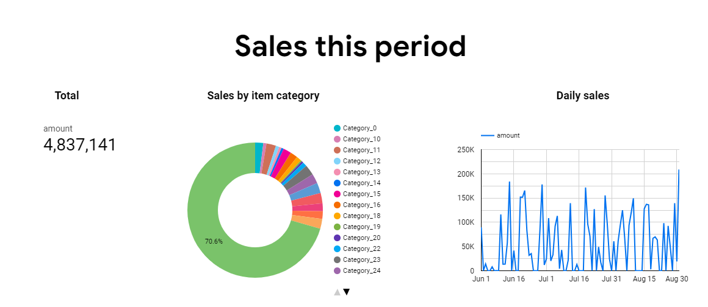

### **Task 6: Create a simple report in Data Studio/Looker Studio**

#### **Theory: Cloud Function**

> ***Duration \[1h\]***
>
> [[Looker introduction \| Google
> Cloud]](https://cloud.google.com/looker/docs/intro?hl=en)

#### **Practice: Create report**

> ***Duration \[2h\]***
>
> Now that we have some data in BigQuery to play around with, we will
> very quickly put together a simple report in **Looker Studio**. In the
> same BigQuery table explorer, export the the table with the Export
> menu to the right to begin exploring the data in **Looker Studio**:
>
> 
>
> The Data Studio UI will open in a separate tab with the table data
> preloaded:
>
> 
>
> We just added 3 very simple visualizations:

-   Sum of the column **amount**,

-   Ring graph with the distribution of percentage of records by
    **item_category**

-   Time series graph with the **amount** by **order_date,** right now
    as the input data only has data for 2 days in the **order_date**
    column, the graph looks weird, we'll add a new file with more
    records to see the difference.

> 
>
> We save the data exploration with the **Save and share** to save the
> report and go from the explore mode to the report mode.
>
> 
>
> Now, from here we can continue adding pages, visualizations and graphs
> to the report, format and apply some nice styles to the report so it
> looks nice and tidy, and prepare it to be shared in many different
> ways or even schedule emailing to share it.
>
> 
>
> We upload the file **DataFile100.csv** (which contains 100 items, or
> DataFile1000.csv,DataFile10000.csv,DataFile100000.csv, [[here is
> files]](https://github.com/stroyanov/gcp-bigdata-practice/tree/main/data))
> to the data source bucket and wait for the data update process to be
> completed.
>
> 
>
> Once done, we can easily refresh the report in Data Studio to send
> another up-to-date report:
>
> 
>
> The data gets refreshed and you can send another updated report:
>
> 

