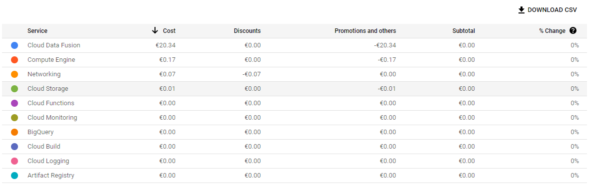
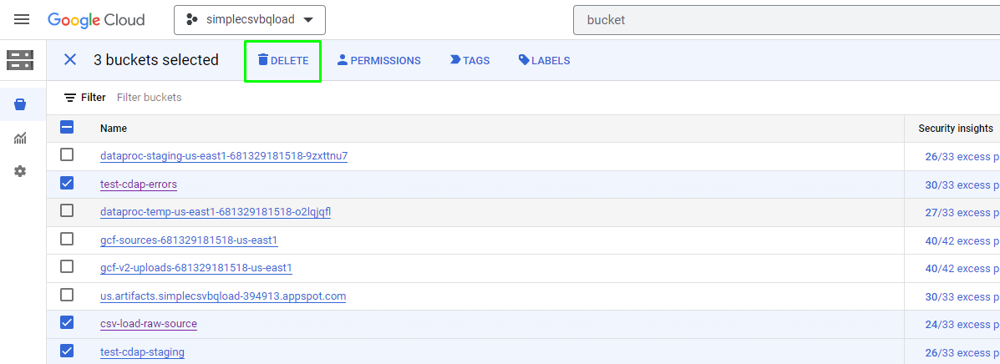
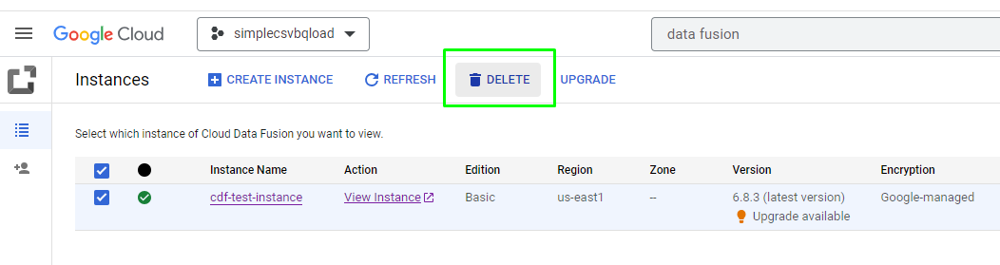
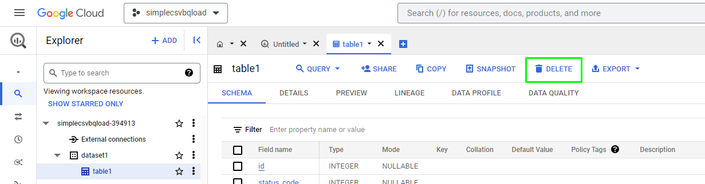
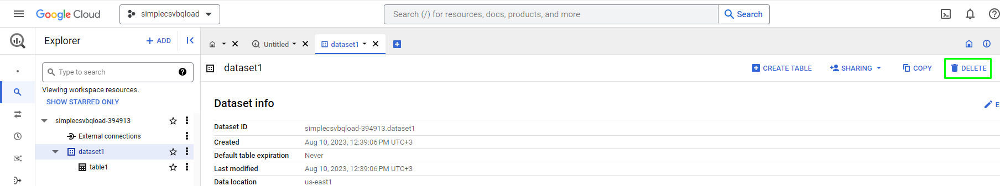
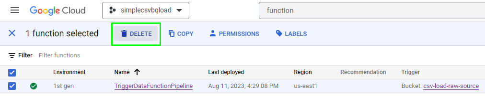

## Final part

## **Cost Consideration**

### **Assumptions**

Region for services is North America (us-east1)

  ---------------------------------------------------------------------------
  **Services**   **Pricing options**       **Cost**
  -------------- ------------------------- ----------------------------------
  Cloud Storage  (per GB per Month)        \~\$0.020
                 \$0.020                   

  Cloud          512MB Memory .333 vCPU    \$0.000000925 (Price/100ms)
  Functions                                

  Cloud Data     (Developer edition, Price \~\$3.5 (10h)
  Fusion         per instance per hour)    
                 \$0.35                    

  BigQuery       (Standard Edition, slot   \~\$4
                 hour) \$0.04              

  Data Studio    free?                     
  ---------------------------------------------------------------------------

Overall costs approximately expected around \$10-15

### **Costs**

Look into Cloud Billing Account: [[View your billing reports and cost
trends]](https://cloud.google.com/billing/docs/how-to/reports)

### **Remove services**

***Duration 1h***

-   **Remove buckets in Cloud Storage**

> 

-   **Remove Data Fusion instances**

> [[Enable or disable Cloud Data
> Fusion]](https://cloud.google.com/data-fusion/docs/how-to/enable-service#disable)
>
> 

-   **Remove datasets in BigQuery**

> 
>
> 

-   **Remove Cloud Function**

> 

## **Reference**

Google console [[Google Cloud
Console]](https://console.cloud.google.com/)

Article with solution [[From Zero to Hero: End-to-end automated
Analytics workload using Cloud Functions --- Data Fusion --- BigQuery
and Data Studio \| by Daniel Villegas \| Google Cloud - Community \|
Medium]](https://medium.com/google-cloud/from-zero-to-hero-end-to-end-automated-analytics-workload-using-cloud-functions-data-fusion-28670e5e7c74)

### 
