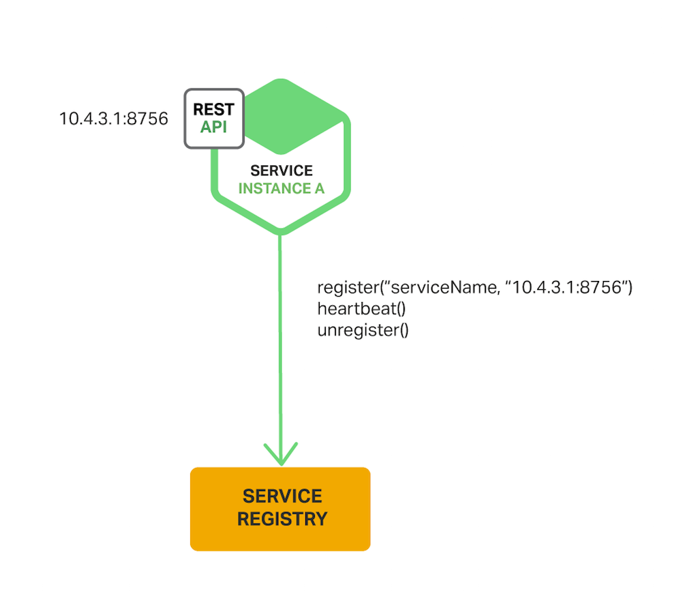

# Table of Content

- [Service Discovery in a Microservices Architecture](#service-discovery-in-a-microservices-architecture)
- [Service Registration and Discovery](#service-registration-and-discovery)
- [Additional reading](#additional-reading)
- [Questions](#questions)

# Service Discovery in a Microservices Architecture

## Why Use Service Discovery?

Let’s imagine that you are writing some code that invokes a service that has a REST API or Thrift API. In order to make a request, your code needs to know the network location (IP address and port) of a service instance. In a traditional application running on physical hardware, the network locations of service instances are relatively static. For example, your code can read the network locations from a configuration file that is occasionally updated.

In a modern, cloud‑based microservices application, however, this is a much more difficult problem to solve as shown in the following diagram.


Service instances have dynamically assigned network locations. Moreover, the set of service instances changes dynamically because of autoscaling, failures, and upgrades. Consequently, your client code needs to use a more elaborate service discovery mechanism.

There are two main service discovery patterns: client‑side discovery and server‑side discovery. Let’s first look at client‑side discovery.

## The Client‑Side Discovery Pattern

When using client‑side discovery, the client is responsible for determining the network locations of available service instances and load balancing requests across them. The client queries a service registry, which is a database of available service instances. The client then uses a load‑balancing algorithm to select one of the available service instances and makes a request.

The following diagram shows the structure of this pattern.


The network location of a service instance is registered with the service registry when it starts up. It is removed from the service registry when the instance terminates. The service instance’s registration is typically refreshed periodically using a heartbeat mechanism.

[Netflix OSS](https://netflix.github.io/) provides a great example of the client‑side discovery pattern. [Netflix Eureka](https://github.com/Netflix/eureka) is a service registry. It provides a REST API for managing service‑instance registration and for querying available instances. [Netflix Ribbon](https://github.com/Netflix/ribbon) is an IPC client that works with Eureka to load balance requests across the available service instances. We will discuss Eureka in more depth later in this article.

The client‑side discovery pattern has a variety of benefits and drawbacks. This pattern is relatively straightforward and, except for the service registry, there are no other moving parts. Also, since the client knows about the available services instances, it can make intelligent, application‑specific load‑balancing decisions such as using hashing consistently. One significant drawback of this pattern is that it couples the client with the service registry. You must implement client‑side service discovery logic for each programming language and framework used by your service clients.

Now that we have looked at client‑side discovery, let’s take a look at server‑side discovery.

## The Server‑Side Discovery Pattern

The other approach to service discovery is the [server-side discovery pattern](https://microservices.io/patterns/server-side-discovery.html). The following diagram shows the structure of this pattern.


The client makes a request to a service via a load balancer. The load balancer queries the service registry and routes each request to an available service instance. As with client‑side discovery, service instances are registered and deregistered with the service registry.

The [AWS Elastic Load Balancer](https://aws.amazon.com/ru/elasticloadbalancing/) (ELB) is an example of a server-side discovery router. An ELB is commonly used to load balance external traffic from the Internet. However, you can also use an ELB to load balance traffic that is internal to a virtual private cloud (VPC). A client makes requests (HTTP or TCP) via the ELB using its DNS name. The ELB load balances the traffic among a set of registered Elastic Compute Cloud (EC2) instances or EC2 Container Service (ECS) containers. There isn’t a separate service registry. Instead, EC2 instances and ECS containers are registered with the ELB itself.

HTTP servers and load balancers such as [NGINX Plus](https://www.nginx.com/products/) and NGINX can also be used as a server-side discovery load balancer. For example, this [blog post](https://www.airpair.com/scalable-architecture-with-docker-consul-and-nginx) describes using [Consul Template](https://github.com/hashicorp/consul-template) to dynamically reconfigure NGINX reverse proxying. Consul Template is a tool that periodically regenerates arbitrary configuration files from configuration data stored in the [Consul service registry](https://www.consul.io/). It runs an arbitrary shell command whenever the files change. In the example described by the blog post, Consul Template generates an `nginx.conf` file, which configures the reverse proxying, and then runs a command that tells NGINX to reload the configuration. A more sophisticated implementation could dynamically reconfigure NGINX Plus using either [its HTTP API or DNS](https://www.nginx.com/products/nginx/load-balancing/#load-balancing-api).

Some deployment environments such as [Kubernetes](https://github.com/kubernetes/kubernetes/) and [Marathon](https://mesosphere.github.io/marathon/docs/service-discovery-load-balancing.html) run a proxy on each host in the cluster. The proxy plays the role of a server‑side discovery load balancer. In order to make a request to a service, a client routes the request via the proxy using the host’s IP address and the service’s assigned port. The proxy then transparently forwards the request to an available service instance running somewhere in the cluster.

The server‑side discovery pattern has several benefits and drawbacks. One great benefit of this pattern is that details of discovery are abstracted away from the client. Clients simply make requests to the load balancer. This eliminates the need to implement discovery logic for each programming language and framework used by your service clients. Also, as mentioned above, some deployment environments provide this functionality for free. This pattern also has some drawbacks, however. Unless the load balancer is provided by the deployment environment, it is yet another highly available system component that you need to set up and manage.

## The Service Registry

The [service registry](https://microservices.io/patterns/service-registry.html) is a key part of service discovery. It is a database containing the network locations of service instances. A service registry needs to be highly available and up to date. Clients can cache network locations obtained from the service registry. However, that information eventually becomes out of date and clients become unable to discover service instances. Consequently, a service registry consists of a cluster of servers that use a replication protocol to maintain consistency.

As mentioned earlier, [Netflix Eureka](https://github.com/Netflix/eureka) is good example of a service registry. It provides a REST API for registering and querying service instances. A service instance registers its network location using a POST request. Every 30 seconds it must refresh its registration using a PUT request. A registration is removed by either using an HTTP DELETE request or by the instance registration timing out. As you might expect, a client can retrieve the registered service instances by using an HTTP GET request.

[Netflix achieves high availability](https://github.com/Netflix/eureka/wiki/) by running one or more Eureka servers in each Amazon EC2 availability zone. Each Eureka server runs on an EC2 instance that has an Elastic IP address. DNS TEXT records are used to store the Eureka cluster configuration, which is a map from availability zones to a list of the network locations of Eureka servers. When a Eureka server starts up, it queries DNS to retrieve the Eureka cluster configuration, locates its peers, and assigns itself an unused Elastic IP address.

Eureka clients – services and service clients – query DNS to discover the network locations of Eureka servers. Clients prefer to use a Eureka server in the same availability zone. However, if none is available, the client uses a Eureka server in another availability zone.

Other examples of service registries include:

- [etcd](https://github.com/etcd-io/etcd) – A highly available, distributed, consistent, key‑value store that is used for shared configuration and service discovery. Two notable projects that use etcd are Kubernetes and [Cloud Foundry](https://pivotal.io/platform).
- [consul](https://www.consul.io/) – A tool for discovering and configuring services. It provides an API that allows clients to register and discover services. Consul can perform health checks to determine service availability.
- [Apache Zookeeper](https://zookeeper.apache.org/) – A widely used, high‑performance coordination service for distributed applications. Apache Zookeeper was originally a subproject of Hadoop but is now a top‑level project.

Also, as noted previously, some systems such as Kubernetes, Marathon, and AWS do not have an explicit service registry. Instead, the service registry is just a built‑in part of the infrastructure.

Now that we have looked at the concept of a service registry, let’s look at how service instances are registered with the service registry.

## Service Registration Options

As previously mentioned, service instances must be registered with and deregistered from the service registry. There are a couple of different ways to handle the registration and deregistration. One option is for service instances to register themselves, the [self‑registration pattern](https://microservices.io/patterns/self-registration.html). The other option is for some other system component to manage the registration of service instances, the [third‑party registration pattern](https://microservices.io/patterns/3rd-party-registration.html). Let’s first look at the self‑registration pattern.

## The Self‑Registration Pattern

When using the [self‑registration pattern](https://microservices.io/patterns/self-registration.html), a service instance is responsible for registering and deregistering itself with the service registry. Also, if required, a service instance sends heartbeat requests to prevent its registration from expiring. The following diagram shows the structure of this pattern.



A good example of this approach is the [Netflix OSS Eureka client](https://github.com/Netflix/eureka). The Eureka client handles all aspects of service instance registration and deregistration. The [Spring Cloud project](https://spring.io/projects/spring-cloud), which implements various patterns including service discovery, makes it easy to automatically register a service instance with Eureka. You simply annotate your Java Configuration class with an @EnableEurekaClient annotation.

The self‑registration pattern has various benefits and drawbacks. One benefit is that it is relatively simple and doesn’t require any other system components. However, a major drawback is that it couples the service instances to the service registry. You must implement the registration code in each programming language and framework used by your services.

The alternative approach, which decouples services from the service registry, is the third‑party registration pattern.

## The Third‑Party Registration Pattern

When using the [third-party registration pattern](https://microservices.io/patterns/3rd-party-registration.html), service instances aren’t responsible for registering themselves with the service registry. Instead, another system component known as the service registrar handles the registration. The service registrar tracks changes to the set of running instances by either polling the deployment environment or subscribing to events. When it notices a newly available service instance it registers the instance with the service registry. The service registrar also deregisters terminated service instances. The following diagram shows the structure of this pattern.


One example of a service registrar is the open source [Registrator](https://github.com/gliderlabs/registrator) project. It automatically registers and deregisters service instances that are deployed as Docker containers. Registrator supports several service registries, including etcd and Consul.

Another example of a service registrar is [NetflixOSS Prana](https://github.com/netflix/Prana). Primarily intended for services written in non‑JVM languages, it is a sidecar application that runs side by side with a service instance. Prana registers and deregisters the service instance with Netflix Eureka.

The service registrar is a built‑in component of deployment environments. The EC2 instances created by an Autoscaling Group can be automatically registered with an ELB. Kubernetes services are automatically registered and made available for discovery.

The third‑party registration pattern has various benefits and drawbacks. A major benefit is that services are decoupled from the service registry. You don’t need to implement service‑registration logic for each programming language and framework used by your developers. Instead, service instance registration is handled in a centralized manner within a dedicated service.

One drawback of this pattern is that unless it’s built into the deployment environment, it is yet another highly available system component that you need to set up and manage.

## Summary

In a microservices application, the set of running service instances changes dynamically. Instances have dynamically assigned network locations. Consequently, in order for a client to make a request to a service it must use a service‑discovery mechanism.

A key part of service discovery is the [service registry](https://microservices.io/patterns/service-registry.html). The service registry is a database of available service instances. The service registry provides a management API and a query API. Service instances are registered with and deregistered from the service registry using the management API. The query API is used by system components to discover available service instances.

There are two main service‑discovery patterns: client-side discovery and service-side discovery. In systems that use [client‑side service discovery](https://microservices.io/patterns/client-side-discovery.html), clients query the service registry, select an available instance, and make a request. In systems that use [server‑side discovery](https://microservices.io/patterns/server-side-discovery.html), clients make requests via a router, which queries the service registry and forwards the request to an available instance.

There are two main ways that service instances are registered with and deregistered from the service registry. One option is for service instances to register themselves with the service registry, the [self‑registration pattern](https://microservices.io/patterns/self-registration.html). The other option is for some other system component to handle the registration and deregistration on behalf of the service, the [third‑party registration pattern](https://microservices.io/patterns/3rd-party-registration.html).

In some deployment environments you need to set up your own service‑discovery infrastructure using a service registry such as [Netflix Eureka](https://github.com/Netflix/eureka), [etcd](https://github.com/etcd-io/etcd), or [Apache Zookeeper](https://zookeeper.apache.org/). In other deployment environments, service discovery is built in. For example, Kubernetes and [Marathon](https://mesosphere.github.io/marathon/docs/service-discovery-load-balancing.html) handle service instance registration and deregistration. They also run a proxy on each cluster host that plays the role of [server‑side discovery](https://microservices.io/patterns/server-side-discovery.html) router.

An HTTP reverse proxy and load balancer such as NGINX can also be used as a server‑side discovery load balancer. The service registry can push the routing information to NGINX and invoke a graceful configuration update; for example, you can use [Consul Template](https://hashicorp.com/blog/introducing-consul-template.html). NGINX Plus supports [additional dynamic reconfiguration mechanisms](https://www.nginx.com/products/nginx/load-balancing/#load-balancing-api) – it can pull information about service instances from the registry using DNS, and it provides an API for remote reconfiguration.

# Service Registration and Discovery

This guide walks you through the process of starting and using the Netflix Eureka service registry.

## What You Will Build

You will set up a [Netflix Eureka service registry](https://github.com/spring-cloud/spring-cloud-netflix) and then build a client that both registers itself with the registry and uses it to resolve its own host. A service registry is useful because it enables client-side load-balancing and decouples service providers from consumers without the need for DNS.

## What You Need

- About 15 minutes
- A favorite text editor or IDE
- [JDK 1.8](https://www.oracle.com/java/technologies/downloads/) or later
- [Gradle 4+](https://gradle.org/install/) or [Maven 3.2+](https://maven.apache.org/download.cgi)
- You can also import the code straight into your IDE:
    - [Spring Tool Suite (STS)](https://spring.io/guides/gs/sts/)
    - [IntelliJ IDEA](https://spring.io/guides/gs/intellij-idea/)

## How to complete this guide

Like most Spring [Getting Started guides](https://spring.io/guides), you can start from scratch and complete each step or you can bypass basic setup steps that are already familiar to you. Either way, you end up with working code.

To **start from scratch**, move on to [Starting with Spring Initializr](https://spring.io/guides/gs/service-registration-and-discovery/#scratch).
To **skip the basics**, do the following:

- [Download](https://github.com/spring-guides/gs-service-registration-and-discovery/archive/main.zip) and unzip the source repository for this guide, or clone it using Git: `git clone https://github.com/spring-guides/gs-service-registration-and-discovery.git`
- cd into `gs-service-registration-and-discovery/initial`
- Jump ahead to [Start a Eureka Service Registry](#start-a-eureka-service-registry)

When you finish, you can check your results against the code in `gs-service-registration-and-discovery/complete`.

## Starting with Spring Initializr

For all Spring applications, you should start with the [Spring Initializr](https://start.spring.io/). The Initializr offers a fast way to pull in all the dependencies you need for an application and does a lot of the set up for you.

This guide needs two applications. The first application (the service application) needs only the Eureka Server dependency.

The second application (the client application) needs the Eureka Server and Eureka Discovery Client dependencies.

_For convenience, we have provided build files (a `pom.xml` file and a `build.gradle` file) at the top of the project (one directory above the `service` and `client` directories) that you can use to build both projects at once. We also added the Maven and Gradle wrappers there._

You can use this [pre-initialized project](https://start.spring.io/) (for the service application) or this [pre-initialized project](https://start.spring.io/) (for the client application) and click Generate to download a ZIP file. This project is configured to fit the examples in this tutorial.

To manually initialize the project:

- Navigate to [https://start.spring.io](https://start.spring.io/). This service pulls in all the dependencies you need for an application and does most of the setup for you.
- Choose either Gradle or Maven and the language you want to use. This guide assumes that you chose Java.
- Click **Dependencies** and select **Eureka Server** for the service application and **Eureka Server** and **Eureka Discovery Client** for the client application.
- Click **Generate**.
- Download the resulting ZIP file, which is an archive of a web application that is configured with your choices.

_If your IDE has the Spring Initializr integration, you can complete this process from your IDE._

_You can also fork the project from Github and open it in your IDE or other editor._

## Start a Eureka Service Registry

You first need a Eureka Service registry. You can use Spring Cloud’s `@EnableEurekaServer` to stand up a registry with which other applications can communicate. This is a regular Spring Boot application with one annotation (`@EnableEurekaServer`) added to enable the service registry. The following listing (from `eureka-service/src/main/java/com.example.serviceregistrationanddiscoveryservice/ServiceRegistrationAndDiscoveryServiceApplication.java`) shows the service application:

```java
package com.example.serviceregistrationanddiscoveryservice;

import org.springframework.boot.SpringApplication;
import org.springframework.boot.autoconfigure.SpringBootApplication;
import org.springframework.cloud.netflix.eureka.server.EnableEurekaServer;

@EnableEurekaServer
@SpringBootApplication
public class ServiceRegistrationAndDiscoveryServiceApplication {

	public static void main(String[] args) {
		SpringApplication.run(ServiceRegistrationAndDiscoveryServiceApplication.class, args);
	}
}
```

When the registry starts, it will complain (with a stacktrace) that there are no replica nodes to which the registry can connect. In a production environment, you will want more than one instance of the registry. For our simple purposes, however, it suffices to disable the relevant logging.

By default, the registry also tries to register itself, so you need to disable that behavior as well.

It is a good convention to put this registry on a separate port when using it locally.

Add some properties to `eureka-service/src/main/resources/application.properties` to handle all of these requirements, as the following listing shows:

```yaml
server.port=8761

eureka.client.register-with-eureka=false
eureka.client.fetch-registry=false

logging.level.com.netflix.eureka=OFF
logging.level.com.netflix.discovery=OFF
```

## Talking to the Registry

Now that you have started a service registry, you can stand up a client that both registers itself with the registry and uses the Spring Cloud `DiscoveryClient` abstraction to interrogate the registry for its own host and port. The `@EnableDiscoveryClient` activates the Netflix Eureka `DiscoveryClient` implementation. (There are other implementations for other service registries, such as [Hashicorp’s Consul](https://www.consul.io/) or [Apache Zookeeper](https://zookeeper.apache.org/)). The following listing (from `eureka-client/src/main/java/example/serviceregistrationanddiscoveryclient/ServiceRegistrationAndDiscoveryClientApplication.java`) shows the client application:

```java
package com.example.serviceregistrationanddiscoveryclient;

import java.util.List;

import org.springframework.beans.factory.annotation.Autowired;
import org.springframework.boot.SpringApplication;
import org.springframework.boot.autoconfigure.SpringBootApplication;
import org.springframework.cloud.client.ServiceInstance;
import org.springframework.cloud.client.discovery.DiscoveryClient;
import org.springframework.web.bind.annotation.PathVariable;
import org.springframework.web.bind.annotation.RequestMapping;
import org.springframework.web.bind.annotation.RestController;

@SpringBootApplication
public class ServiceRegistrationAndDiscoveryClientApplication {

	public static void main(String[] args) {
		SpringApplication.run(ServiceRegistrationAndDiscoveryClientApplication.class, args);
	}
}

@RestController
class ServiceInstanceRestController {

	@Autowired
	private DiscoveryClient discoveryClient;

	@RequestMapping("/service-instances/{applicationName}")
	public List<ServiceInstance> serviceInstancesByApplicationName(
			@PathVariable String applicationName) {
		return this.discoveryClient.getInstances(applicationName);
	}
}
```

Whatever implementation you choose, you should soon see `eureka-client` registered under whatever name you specify in the `spring.application.name` property. This property is used a lot in Spring Cloud, often in the earliest phases of a service’s configuration. This property is used in service bootstrap and, so, by convention lives in `eureka-client/src/main/resources/bootstrap.properties` where it is found before `src/main/resources/application.properties`. The following listing shows the `bootstrap.properties` file:

```
Unresolved directive in <stdin> - include::complete/eureka-client/src/main/resources/bootstrap.properties[]
```

The `eureka-client` defines a Spring MVC REST endpoint (`ServiceInstanceRestController`) that returns an enumeration of all the registered `ServiceInstance` instances at `http://localhost:8080/service-instances/a-bootiful-client`. See the [Building a RESTful Web Service](https://spring.io/guides/gs/rest-service/) guide to learn more about building REST services with Spring MVC and Spring Boot.

## Test the Application

Test the end-to-end result by starting the `eureka-service` first and then, once that has loaded, starting the `eureka-client`.

To run the Eureka service with Maven, run the following command in a terminal window (in the `/complete` directory):

```
./mvnw spring-boot:run -pl eureka-service
```

To run the Eureka client with Maven, run the following command in a terminal window (in the `/complete` directory):

```
./mvnw spring-boot:run -pl eureka-client
```

To run the Eureka service with Gradle, run the following command in a terminal window (in the `/complete` directory):

```
./gradlew :eureka-service:bootRun
```

To run the Eureka client with Gradle, run the following command in a terminal window (in the `/complete` directory):

```
./gradlew :eureka-client:bootRun
```

The `eureka-client` will take about a minute to register itself in the registry and to refresh its own list of registered instances from the registry. Visit the `eureka-client` in the browser, at `http://localhost:8080/service-instances/a-bootiful-client`. There, you should see the `ServiceInstance` for the `eureka-client` reflected in the response. If you see an empty `<List>` element, wait a bit and refresh the page.

## Summary

Congratulations! You have just used Spring to stand up a Netflix Eureka service registry and to use that registry in a client application.

## See Also

The following guides may also be helpful:

- [Building a RESTful Web Service](https://spring.io/guides/gs/rest-service/)
- [Serving Web Content with Spring MVC](https://spring.io/guides/gs/serving-web-content/)
- [Building an Application with Spring Boot](https://spring.io/guides/gs/spring-boot/)

# Additional reading

- [Client-Side Load-Balancing with Spring Cloud LoadBalancer](https://spring.io/guides/gs/spring-cloud-loadbalancer/)
- [Spring Cloud Gateway](https://spring.io/projects/spring-cloud-gateway)
- [Pattern: Client-side service discovery](https://microservices.io/patterns/client-side-discovery.html)
- [Pattern: Server-side service discovery](https://microservices.io/patterns/server-side-discovery.html)
- [Microservices — Centralized Configuration with Spring Cloud](https://medium.com/@ijayakantha/microservices-centralized-configuration-with-spring-cloud-f2a1f7b78cc2)
- [Spring Cloud Config for Shared Microservice Configuration](https://developer.okta.com/blog/2020/12/07/spring-cloud-config)
- [GIT backed Spring Cloud config server](https://www.youtube.com/watch?v=VzskpJEBtPw) [Video]
- [Microservices configuration best practices](https://www.youtube.com/watch?v=AiGCx0raQfs) [Video]
- [Spring Cloud](https://www.linkedin.com/learning/spring-spring-cloud-2/spring-to-the-cloud) [Video course]
- [Cloud Architecture: Core Concepts](https://www.linkedin.com/learning/cloud-architecture-core-concepts-15687584/what-is-cloud-architecture) [Video course]
- [What is service discovery really all about?](https://www.youtube.com/watch?v=GboiMJm6WlA&t=258s) [Video]

# Questions

- What is Service Discovery? What is a purpose of Service Registry?
- What is the difference between Server-Side and Client-Side Balancing?
- What are benefits of Service-Side load-balancing?
