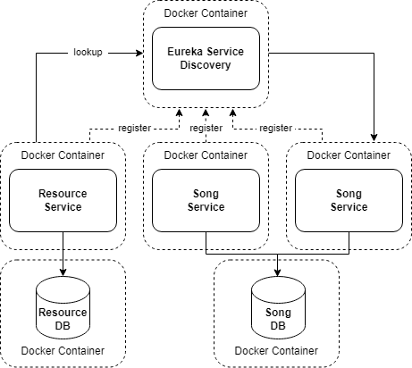

# Table of contents

- [What to do](#what-to-do)
- [Sub-task 1: Service registry](#sub-task-service-registry)
- [Sub-task 2: Prepare for final screening](#sub-task-prepare-for-final-screening)
- [Checklist: Before you submit the task](#checklist-before-you-submit-the-task)

## What to do

In this module, you need to integrate a service registry tool into your infrastructure.  
You can refer to a sample implementation using **Eureka** here: [Eureka Example](https://www.javainuse.com/spring/cloud-gateway-eureka).

Afterward, prepare for the final screening, where you may need to demonstrate the complete functionality of the application with the integrated service registry.

## Sub-task 1: Service registry

1) Use the Eureka Service Registry for [Service Registration and Discovery](https://spring.io/guides/gs/service-registration-and-discovery/).


2) Ensure that all microservices act as Eureka clients and register with the Eureka server (which includes both the Load Balancer and Service Registry).


3) Ensure the application runs seamlessly in both **local** and **Docker Compose** environments:

    - **For local execution:** Use default values in `application.properties` or `application.yml`.

    - **For Docker Compose:** Pull settings from the `.env` file, and use the `--scale song-service=2` option (or set replicas in `docker-compose.yml`) to run **two instances** of the Song Service for load balancing.




## Sub-task 2: Prepare for final screening

1) Prepare a link to the final version of your project in a public repository. This should be shared directly with your mentor upon their request (there’s no need to upload it to Avalia this time).


2) Prepare for a demo where you will demonstrate the functionality of the entire application, including all major features and use cases, as specified in the task. Let's review what you need to do during this final screening.

### **Step 1: Run the application in Docker Compose**

**1. Ensure a clean environment**  
Before running the application in Docker, stop any previously running containers:
```bash
$ docker compose down
```

**2. Start the entire application in Docker**

***Option 1: Scaling with dynamic ports***

Run the following command to build the images, start the containers, and scale the Song Service to two instances:

```bash
$ docker compose up -d --build --scale song-service=2
```  

Docker assigns **random ports** to each instance of the Song Service. To check them, run `docker ps` and use one of the displayed ports in Postman.

> **Optional**: Use an **API Gateway** (e.g., Spring Cloud Gateway) to route requests automatically.


***Option 2: Scaling with fixed ports***

Modify `docker-compose.yml` to define replicas and a port range, e.g.:

```yaml
song-service:
  deploy:
    replicas: 2
  ports:
    - 8082-8083:8082
```  

Then start the application normally:

```bash
$ docker compose up -d --build
```  

Both Song Service instances run on fixed ports (`8082` and `8083`).


**3. Verify that all required containers are running**  
Check the status of running containers:
```bash
$ docker ps
```

**4. Check logs for key services**  
Monitor the logs to ensure the services are starting correctly:
```bash
$ docker compose logs -f resource-service song-service
```

**5. Verify Eureka registration**
- Open `http://localhost:8761` in a browser.
- Ensure that one Resource Service instance and two Song Service instances are registered.

**6. Run Postman tests**
- Use the provided [Postman collection](../microservice_architecture_overview/api-tests/introduction_to_microservices.postman_collection.json) and [sample MP3 file](../microservice_architecture_overview/sample-mp3-file/mp3.zip).
- Ensure that **all** tests pass.

> **Note:** Since multiple Song Service instances run with dynamic ports, Postman cannot access them directly using a fixed port. There are two solutions:
> 1. Run the `docker ps` command to find the currently assigned ports, then use one of them in Postman.
> 2. Use an API Gateway (e.g., Spring Cloud Gateway) to route requests. The API Gateway will automatically forward requests to an available Song Service instance.

**7. Stop the Docker-based execution**  
After successful verification:
```bash
$ docker compose down
```

---

### **Step 2: Run the application locally (services in IntelliJ, databases in Docker)**

**1. Start only the databases in Docker**
```bash
$ docker compose up -d resource-db song-db
```
- This starts the databases while keeping the microservices out of Docker.

**2. Verify that the database containers are running**
```bash
$ docker ps
```

**3. Run Eureka Server and microservices in IntelliJ**
- Start Eureka Server, Resource Service, and Song Service in IntelliJ.

**4. Verify Eureka registration**
- Open `http://localhost:8761` and confirm that both services are listed.

**5. Run a few Postman tests**
- Use the same Postman collection to verify API functionality.

---

## Checklist: Before you submit the task

Before submitting your task, please ensure that you have completed all the required steps:

✅ **Service Registry implementation**
- [ ] Configured a Eureka Server for service registration and discovery.
- [ ] Resource Service and Song Service are configured as Eureka clients.
- [ ] Eureka Server is correctly running at `http://localhost:8761`.
- [ ] Verified that services register with Eureka when started.
- [ ] Eureka configuration supports both local execution and Docker Compose.
- [ ] Scaling is enabled: the Song Service can run two instances when using Docker Compose.

✅ **Running the application in Docker Compose**
- [ ] Cleaned previous containers before deployment (`docker compose down`).
- [ ] Built and started all services with scaling (`docker compose up -d --build --scale song-service=2` or `docker compose up -d --build`).
- [ ] Checked running containers with `docker ps`.
- [ ] Verified logs to ensure correct startup (`docker compose logs -f resource-service song-service`).
- [ ] Opened `http://localhost:8761` to check if:
   - [ ] One instance of Resource Service is registered.
   - [ ] Two instances of Song Service are registered.
- [ ] Successfully tested APIs using the Postman collection.
- [ ] Stopped Docker containers after testing (`docker compose down`).

✅ **Running the application locally (databases in Docker, services in IntelliJ)**
- [ ] Started only the databases in Docker (`docker compose up -d resource-db song-db`).
- [ ] Checked database containers are running (`docker ps`).
- [ ] Ran Eureka Server, Resource Service, and Song Service in IntelliJ.
- [ ] Opened `http://localhost:8761` to verify that both services are registered.
- [ ] Successfully tested APIs using the Postman collection.

✅ **Final submission & demo preparation**
- [ ] Created a public Git repository with the final version of the project.
- [ ] Ready to share the repository link with the mentor upon request.
- [ ] Prepared for a demo showing:
   - [ ] Application running in Docker Compose.
   - [ ] Application running locally with databases in Docker.
   - [ ] Service registration in Eureka.
   - [ ] API requests working correctly using Postman.
