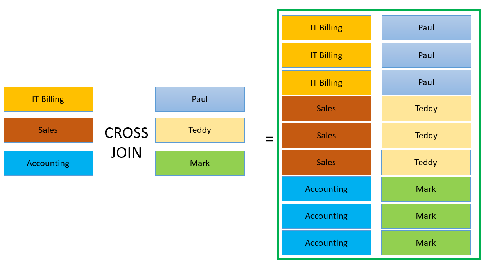
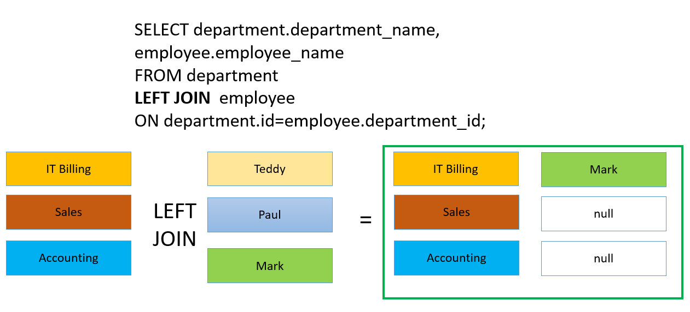
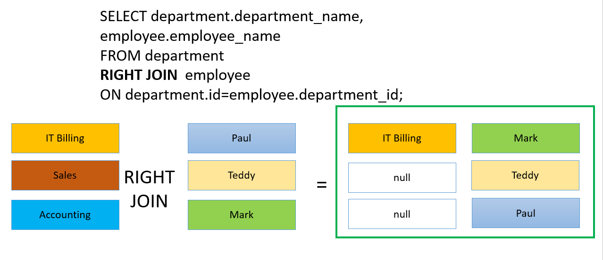
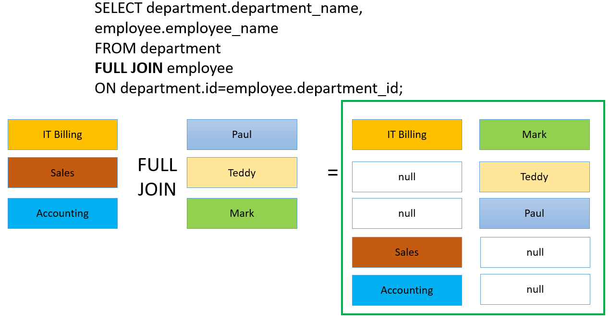
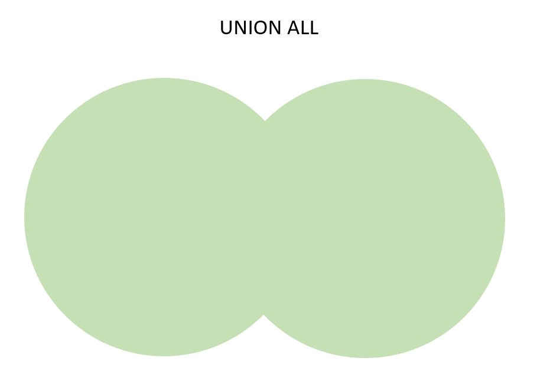
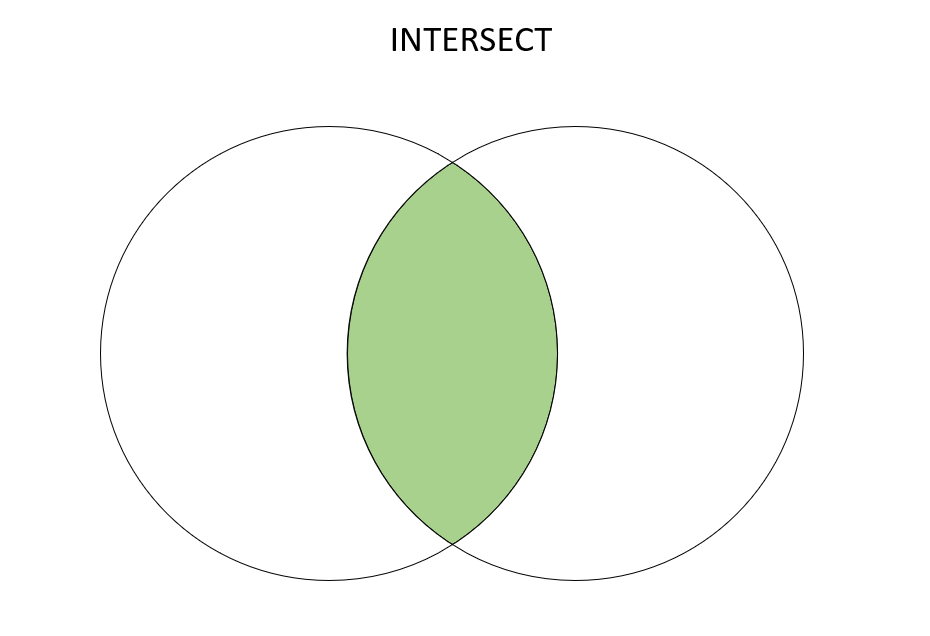
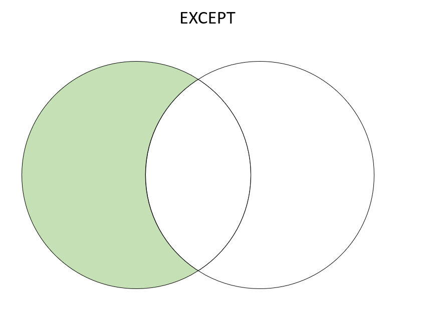

# Data Manipulation Statements

### Table Of Contents
* [Insert](#INSERT), [Update](#UPDATE), [Delete](#DELETE)
* [Joins](#Joins)
* [Delete VS Drop VS Truncate](#Delete VS Drop VS Truncate)
* [Horizontal Combinations of Tables](#Horizontal Combinations of Tables)
* [Vertical Combinations of Tables](#Vertical Combinations of Tables)
* [Nested Selects and Subqueries](#Nested Selects and Subqueries)


### Your Goals
After competing this module about DML (Data manipulation Statements)
you will be able to:
* Identify and use Data Manipulation Statements, include
INSERT, UPDATE, DELETE, TRUNCATE.
* Distinguish between DELETE, DROP, and TRUNCATE
* Perform horizontal combination of tables by creating
different types of joins (Inner Join, Left Join, Right JOIN, etc.)
* Perform vertical table combinations (Union, Intersect, Except)
* Use nested SELECT statements (nested selects and subqueries)

If you want to follow along with the examples provided, you need
RDBMS (PostgreSQL recommended). The scripts for table set-up and
examples are provided in the 'scripts' section.

### Data Manipulation Statements Overview
Data manipulation statements include operations of inserting,
deleting, or updating the data.

# Insert, Update, Delete
### INSERT
INSERT statement is used to insert one or more rows into a table.
Typical insert statement looks like the following:
```
INSERT INTO employee(employee_id, employee_name, department_name)
	VALUES (1, 'Paul', 'IT Billing'); 
```
Notice that After INSERT INTO statement we need to indicate
the name of the table, which in our case is called employee.
After the VALUES, inside parenthesis, we indicate the values
for table columns (employee_id, employee_name, department_name).

We can also perform single INSERT statement to include values
for multiple records, as it is shown below:
```
INSERT INTO employee(
	employee_id, employee_name, department_name)
VALUES 
	(1, 'Paul', 'IT Billing'),
	(3, 'Teddy', 'Sales'),
	(4, 'Mark', 'Accounting');
```

### UPDATE
If we need to change existing records in our database,
we need to go for the UPDATE statement. UPDATE changes the values
of the specified columns in all rows that satisfy the condition.
Here is an example of an UPDATE operation:
```
UPDATE employee SET employee_name = 'Thomas'
WHERE employee_name = 'Mark';
```
After executing this statement, each record in the employee
table that has the value 'Mark' in employee_name column,
will be changed with 'Thomas'.

### DELETE
DELETE statement deletes rows that satisfy the WHERE clause
from the specified table. If WHERE clause is absent, then
all the rows in the table will be deleted. The result is
a valid empty table.<br />
Here is an example of DELETE statement:
```
DELETE FROM employee
WHERE employee_id=4;
```
After executing this query, the employee with the id 
of 4, which in our case is named 'Mark', will be removed
from the table. Note, that the employee_id
number was indicated and WHERE clause was used. 
Sometimes, we might use DELETE without the WHERE clause,
as it is shown below:
```
DELETE FROM employee;
```
In this case, all the records from the employee table
will be gone.


## Delete VS Drop VS Truncate
It is important to distinguish between DELETE, DROP, 
and TRUNCATE statements.  

DELETE is used to delete one or more records from the table.
TRUNCATE statement is used to delete all the rows from the
table, instead of selectively deleting the certain  records. Note, 
that you can make rollback on DELETE, meaning that you can revert 
the deletion, but you cannot do the same for TRUNCATE statement.
In terms of speed, TRUNCATE is faster than DELETE statement.
TRUNCATE TABLE cannot activate a trigger because the operation does not log individual row deletions.


DROP command is used to drop the table. It removes any indexes,
rules, triggers, and constraints for the table. After DROP
is executed, table cannot be restored using ROLLBACK.

The truncate query is used to remove the record from the tables. In some 
situations, the truncate query cannot change data records.

You cannot use TRUNCATE TABLE on tables that:
* are referenced by a FOREIGN KEY constraint.
* participate in an indexed view
* are published by using transactional replication or merge replication.
 <br>
For the tables with one or more of these characteristics, use the DELETE statement instead.


## Horizontal Combinations of Tables

### Joins
When writing in SQL, there is a chance you will need to query
data from more than one table. Queries that access multiple tables
at a time are called join queries. They combine rows from
one table with the rows from another table based on the expression,
specifying the join condition.

### Cross Join
Cross Join is a type of join that returns the cartesian product of rows from 
the tables. If you have employee table and department table, both of them
with 3 records, and you call CROSS JOIN on these tables, you will get 
9 records (3 times 3), which is cartesian product, in other words, this type
of join returns all combinations of records from both of the tables. Here
is an example of Cross Join for employee and department tables:

| id  | department | employee_id | id  | name  | age |
|-----|------------|-------------|-----|-------|-----|
| 1   | IT Billing | 1           | 1   | Paul  | 32  |
| 2   | Sales      | 2           | 1   | Paul  | 32  |
| 3   | Accounting | 7           | 1   | Paul  | 32  |
| 1   | IT Billing | 1           | 3   | Teddy | 23  |
| 2   | Sales      | 2           | 3   | Teddy | 23  |
| 3   | Accounting | 7           | 3   | Teddy | 23  |
| 1   | IT Billing | 1           | 4   | Mark  | 25  |
| 2   | Sales      | 2           | 4   | Mark  | 25  |
| 3   | Accounting | 7           | 4   | Mark  | 25  |

As expected, we get total of nine records, for each employee, there is
each department present, and vice versa.

We can imagine cross join visually as it is on the picture below:


<br/>
This is how the syntax looks like:
```
SELECT * FROM department
CROSS JOIN employee;
```

### Inner Join
Inner Join is used when we need to combine only the
matched rows from two or more tables. Matching of the rows happens based on
the concrete condition.  
**Example**:
Suppose, you want to combine rows from employee and
department tables based on department id, you need to write the following:
```
SELECT * FROM department
INNER JOIN  employee
ON department.id=employee.department_id;
```
This will give us the following table:

| id  | department | employee_id | name | age | department_id |
|-----|------------|-------------|------|-----|---------------|
| 1   | IT Billing | 1           | Mark | 25  | 1             |

Out of three departments, only one - IT Billing has an id of 1, that matched the department_id of
employee named Mark. In our example, we made an assumption that Teddy and
Paul do not have department ids assigned, so their values are null, and we cannot
match null with anything since null means the absence of value. This is why we get
only Mark from employees table.  And Note that also one record - IT Billing 
was returned from departments table. This was not the case in cartesian join where
all the records where returned, whether they matched on some conditions or not.


### Left Join
Left Join returns all records from the left table and the matching records from
the right table. 
If we continue our example, with department and employee tables and execute
the following query:
```
SELECT department.department_name, employee.employee_name
FROM department
LEFT JOIN  employee
ON department.id=employee.department_id;
```

|  department | employee_name |
|-------------|---------------|
|  IT Billing | Mark          |
|  Sales      | [null]        |
|  Accounting | [null]        |

From left table - department, we got all three departments, but only one record was
matched from employee table. There are nulls for Sales and Accounting department, because
no employee had department_id of either 2 or 3.
<br/>
Here you can see what left join looks like:
<br/>


### Right Join
Right Join returns all records from the right table and the matching records
from the left table.
Continuing the previous example, if we run the query for right join:
```
SELECT department.department_name, employee.employee_name
FROM department
RIGHT JOIN  employee
ON department.id=employee.department_id;
```
| department_name | employee_name |
|-----------------|---------------|
| IT Billing      | Mark          |
| [null]          | Teddy         |
| [null]          | Paul          |

Now all the records from the right table - employee, are present, but only one department
was matched.  The rest of the employees were not associated with any of the departments.
Here is an illustration for right join:



### Full Join
Full Join, sometimes also called Outer or Full Outer Join, returns all
records when there is a match either in left table of right table.
In our example, if we call FULL JOIN:
```
SELECT department.department_name, employee.employee_name
FROM department
FULL JOIN employee
ON department.id=employee.department_id;
```
We get the following result:

| department_name | employee_name |
|-----------------|---------------|
| IT Billing      | Mark          |
| [null]          | Teddy         |
| [null]          | Paul          |
| Sales           | [null]        |
| Accounting      | [null]        |
Note that we got two unmatched departments: Sales and Accounting without corresponding
employee records, also we got two employees: Teddy and Paul with unmatched departments,
and third employee: Mark, that was matched with IT Billing department.
We can see the illustration of this example on the picture below:



## Vertical Combinations of Tables
In some cases, you may need to perform vertical combination
of the tables. For this purpose there are different operators
provided in SQL. 

### Union
UNION is used to append the results of two queries, one after
the other. Please, note that it does not guarantee the order of rows.
If you followed along with our previous example, there was an employee
table with three columns: employee_id, employee_name, and department_name.
Simplified version of the employee table looks like the following:

| employee_id  | employee_name | department_name |
|--------------|---------------|-----------------|
| 1            | Paul          | IT Billing      |
| 3            | Teddy         | Sales           |
| 4            | Mark          | Accounting      |

Now, let us introduce another table that includes the data for
the top employees in the company.
<b>To view the scripts for creating top_employee table, visit scripts section.<b>

Following table will be created:

| employee_id  | top_employee_name | top_employee_department |
|--------------|-------------------|-------------------------|
| 1            | Paul              | IT Billing              |
| 3            | Teddy             | Sales                   |
| 4            | Mark              | Accounting              |

Now we can perform horizontal table combination, in particular - UNION
operation between the employee and top_employee tables:
```
SELECT * FROM top_employee
UNION 
SELECT * FROM employee;
```
The result will be the table below:

| employee_id | top_employee_name | top_employee_department |
|-------------|-------------------|-------------------------|
| 4           | Mark              | Accounting              |
| 3           | James             | Security                |
| 2           | Teddy             | Sales                   |
| 1           | Paul              | IT Billing              |

Please, note that UNION operator combined the records from two different
tables, but it did not include duplicate records, which is an expected behaviour
from UNION operation.  It chooses distinct records. If you need to 
include duplicate records then UNION ALL must be used. If you do the previous query
with UNION ALL instead of UNION, then you will get the following result:

| employee_id | top_employee_name | top_employee_department |
|-------------|-------------------|-------------------------|
| 1           | Paul              | IT Billing              |
| 2           | James             | Security                |
| 3           | Teddy             | Sales                   |
| 4           | Mark              | Accounting              |
| 1           | Paul              | IT Billing              |
| 2           | Teddy             | Sales                   |
| 3           | Mark              | Accounting              |

We can imagine UNION ALL by looking at the picture below:

In this picture, right and left circles represent top_employee
and employee tables with all employee records. Intersection part
is also marked pink, because UNION ALL includes duplicate records, which are
common for both of the tables.

There are **Important Factors** to consider when you are combining two
select statements with union:
* The number and the order of the columns in the select list of both queries must be 
the same.
* The data types must be compatible.

### Intersect



### Except
EXCEPT statement returns all rows that are in the one result query but not
in another. To understand it well, take a look on the example below. If you
execute the same query of UNION like we did before, but you modify it in
the following way:
```
SELECT * FROM top_employee
UNION 
SELECT * FROM employee
EXCEPT SELECT * FROM employee;
```
Then you will get only a single record:

| employee_id | top_employee_name  | top_employee_department |
|-------------|--------------------|-------------------------|
| 2           | James              | Security                |

James is only exclusive to the left table, which is top_employee, and it is not present in employee table. 
All the remaining records got excluded, because they belong to the right table, in our case - employee.
The SQL EXCEPT clause/operator is used to combine two SELECT statements and returns rows from the first SELECT
statement that are not returned by the second SELECT statement.
This can be visualized with the following illustration below:


## Nested Selects and Subqueries
Subquery is an SQL query nested inside another query. Subqueries can be 
nested inside SELECT, INSERT, UPDATE, DELETE, SET, or DO statements or
inside another subquery.
<br/>
For an example, suppose you have a table called employee_salary with 
employee ids and their respective salary values, and you want to perform select
query to filter employees with salaries above average. The following query
would be useful;
```
SELECT employee_id, salary
FROM employee_salary
WHERE salary > (SELECT AVG(salary)
			   FROM employee_salary);
```
Right after the WHERE clause we have the filtering condition, and on the
right side of inequality operator '>', we created another, nested select
statement to calculate average salary for the employees.